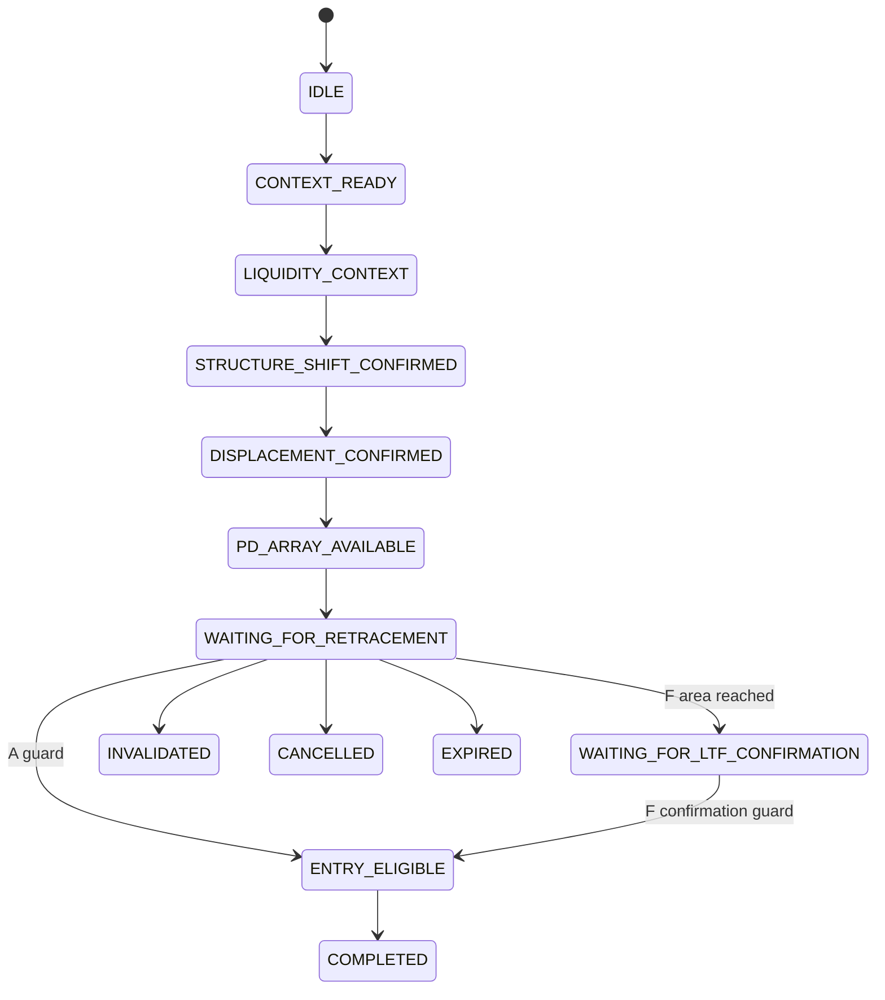

# CP-002 Temporal Strategy Specification & Research Campaign Design V1

Status: **CP-002 Freeze V1: approved pre-result research decisions; unresolved dependencies remain fail-closed**.
Prepared against repository checkpoint `0836cf73af6b6cf98e3e73fc034da52a735cd820`.
This document develops, rather than replaces, the [248-line temporal design audit](CP-002-temporal-hypothesis-design-audit.md). Its primitive inventory and reconstruction limitations remain applicable. The researcher subsequently authorized a separate synthetic-only temporal core. No historical experiment is authorized.

## CP-002 Freeze V1 — Approved Research Decisions

These decisions were explicitly approved by the researcher **PRE-RESULT**, before CP-002 historical execution or outcome inspection. Approval is not empirical evidence. This section and the updated section 14 are normative. Sections 1–13 and 15–18 below preserve the earlier design/provenance discussion: conflicting proposals, optional M1, guessed selection policies and earlier OPEN questions there are superseded by this freeze, not alternative defaults. Section 19 lists the remaining blockers. Deferred models remain deferred.

### Approved contract

1. **Context:** M15 reversals may oppose H4. At setup creation classify completed H4 as `HTF_ALIGNED`, `COUNTER_HTF`, `HTF_NEUTRAL` or `HTF_UNAVAILABLE`. Preserve the reference and relationship immutably. H4 is descriptive, not an eligibility/cancellation gate; later changes never rewrite creation context. No consolidation detector is added.
2. **Branches:** separate `SWEEP_REVERSAL` and `STRUCTURAL_REVERSAL` experiment identities. The former requires a confirmed structural-liquidity wick/reclaim sweep with confirmation time ≤ MSS completion; the latter needs no sweep. Accepted breakout is never a sweep. Only existing structural swing-liquidity is in scope, not session/day/week levels.
3. **Identity/order:** equal completion establishes co-availability, not intrabar order. Selected liquidity parent identity is immutable. No arbitrary liquidity-age cap. Choosing among multiple pools and reuse/regrouping semantics remain explicitly unresolved; the synthetic reducer may consume an explicitly bound parent but does not implement a selector.
4. **Structure:** repository opposing-BOS MSS is the approved proxy, not universal ICT/SMC terminology. Each independently qualifying MSS may start a new generation. No subsequent MSS mutates an older generation or its latched parent evidence.
5. **Displacement:** S requires same-direction displacement on MSS completion. W remains a campaign alternative using the first qualifying same-direction displacement inside a future bounded M15 window. **No numerical W is approved.** Fixture-local W may exercise mechanics; it does not enable a runnable W experiment. Opposite displacement never qualifies.
6. **Arrays:** ordinary FVG only. Require an explicit causal association to the selected displacement impulse. Retain **all** associated valid FVGs as independently tracked sibling areas, with immutable FVG and common sequence parent IDs. Never substitute the latest historical gap. Exact impulse/source-triplet association is still OPEN D25/D27: an implementation may represent authenticated associations but cannot invent their detector. IFVG/OB/breaker/OTE remain deferred.
7. **Contact:** readiness is known only after required evidence is available. Contact requires `contact_time > ready_time`; no entry/contact on formation completion. Inclusive range intersection is `candle.low <= fvg.upper and candle.high >= fvg.lower`, identical for both directions. No close-inside test or OTE gate; premium/discount is descriptive. For the ordinary M15 completion-based A path, contact is observed at completion and the research entry reference is that completed candle's close (inherited convention), not an earlier limit/touch fill. No future close may establish an earlier touch. No extra departure/depth gate is introduced.
8. **Lifetime:** no arbitrary N-bar setup/FVG expiry or hidden active-count cap. Explicit causal structural/array/data invalidation controls lifetime. Terminal identities never reactivate; new evidence creates new generations. Missing candles are not interpolated. Where guard semantics remain undefined, fail closed with an unresolved-dependency reason instead of silently assuming validity.
9. **State:** represent `FORMING`, `MSS_CONFIRMED`, `WAITING_FOR_DISPLACEMENT`, `FVG_AVAILABLE`, `WAITING_FOR_RETRACEMENT`, `CONTACTED`, `WAITING_FOR_M5_CONFIRMATION`, `ENTERED`; terminal reasons include `STRUCTURALLY_INVALIDATED`, `FVG_INVALIDATED`, `DATA_COVERAGE_FAILURE`, `UNLABELABLE`, and explicit unmet/unresolved prerequisites. State/log records are immutable versions. A terminal area cannot suppress or rewrite a sibling. An entered area is consumed exactly once.
10. **Entry variants:** A emits a completion-based hypothetical entry after a valid later contact. F arms only after parent contact and waits for same-direction **M5** repository MSS proxy. Confirmation before contact is rejected; the conservative causal event contract requires a strictly later confirmation completion because equal M15/M5 timestamps do not establish touch-before-confirmation. F never falls back to A. M1 refinement is deferred. M5 confirmation may be recorded while its unapproved entry/fill/horizon path remains disabled.
11. **Risk:** opposite latest causally available protected M15 swing at entry (low bullish/high bearish), frozen without buffer/fallback or H4/LTF substitute. Preserve anchor identity and availability. Missing/nonfinite/zero-risk/wrong-side anchors yield explicit unlabelable reasons. Objective is entry ± 2R. No partials, BE, trailing, daily limits, adaptive management or execution-cost model.
12. **Outcomes:** ordinary M15-close A retains 96 subsequent completed M15 candles, excluding entry candle, conservative stop-first post-entry OHLC ties and descriptive excursions. No labeler/backtest is run or required by this core milestone. M5 entry and partial-M15 interval/horizon semantics remain OPEN; that result path is disabled.
13. **Provenance:** immutable chain: experiment/branch → generation → H4 creation context → optional liquidity parent → MSS → displacement → individual FVG → readiness → contact → entry variant → optional M5 confirmation → causal M15 stop → terminal state. Separate future labels; no label inputs to transitions.

### Implementation boundary and unresolved guards

The authorized deliverable is a modular temporal reducer and synthetic tests, not a historical engine adapter or runnable campaign. Existing primitives do not fully define displacement-impulse/FVG association, all qualifying liquidity classes/selection, pre-entry structural cancellation or same-completion invalidation precedence. Those are genuine remaining blockers. A synthetic fixture may supply an explicitly named association/guard contract and causal validity evidence; it must never be promoted to an approved production rule. The default core fails closed without such evidence. A campaign readiness check must reject unresolved semantics and W without an approved number; accepting a fixture number is not research authorization.

Engineering identity proposal: hash canonical finite JSON of experiment/source identity and immutable event/parent IDs; transition keys include area/generation, event and new state. Reject a reused event ID with different content. Repeated identical events are idempotent. Event availability is aware UTC, ordered by completion; equal-time inputs require a complete batch or a declared stable ordering. Entry and confirmation may not read the enclosing M15 bar before it completes. No checkpoint persistence is implied unless implemented and tested; deterministic full replay is the minimum contract.

No historical CSV, development candidate count, validation/holdout, performance artifact, optimization or connectivity is authorized. The implementation must leave CP-001 and Observer V1 byte-identical. A coherent tested synthetic-only slice is acceptable; unimplemented market adapters and unresolved research guards must be reported, not hidden.

## 1. Executive summary (pre-freeze design background)

CP-002 separates setup formation from later retracement and entry evaluation. The researcher describes a sequence, not simultaneous confluence. The known CP-001 MSS/price-zone contradiction justifies that architectural separation; it supplies no evidence for thresholds, lifetimes, entry prices or additional filters.

Use two distinct hypothesis families: **R, structural reversal**, and **C, trend continuation**. Share causal primitives, identity, retracement monitoring and outcome conventions. **A, aggressive**, and **F, lower-timeframe-confirmed**, are execution variants, not additional market hypotheses. Session-liquidity and Silver Bullet are separately specified extensions; Wyckoff is initially an independent observational research layer. Do not take their Cartesian product.

The first proposed campaign focuses on R with ordinary FVGs. It can compare same-candle versus bounded delayed displacement, and aggressive versus LTF-confirmed entry, only after their unresolved definitions are supplied. Continuation, session models, Silver Bullet, IFVG lifecycle and Wyckoff require separate readiness gates. This staging limits work on the Core 2 Duo; it does not assert that R or FVGs perform better.

Inherit MetaQuotes-Demo M1, EURUSD primary, GBPUSD replication, M15 setup/execution and H4 context. Prefer inherited structural invalidation, 2R comparison endpoint, 96 subsequent M15 bars and conservative ambiguity, with no management overlays. Actual touch fills and LTF entries introduce timing questions that must be resolved rather than hidden by an M15 labeler.

Section 14 gives each D01–D60 exactly one disposition. **RESOLVED means specified in this proposal, not researcher-approved for implementation.** OPEN questions are not defaults; CAMPAIGN_VARIABLE alternatives are not runnable until their dependent questions are closed. No outcome is needed to answer the remaining questions.

## 2. Research boundaries

This milestone writes only this document. No strategy, backtest, observer, loader or campaign-runner code changes; no experiment JSON, Baseline V2, detector implementation, synthetic implementation or historical execution. CP-001, its artifacts and Research Observer V1 remain unchanged.

No historical CSV, observation dataset, label dataset or performance artifact is consulted for rule selection. Frozen specification metadata may be read to identify inherited conventions. No development candles are read. Validation 2023–2024 remains locked; holdout 2025–2026 is not accessed at all. Do not enumerate or hash those datasets as a documentation check. A reference to their date boundaries in an existing specification is not permission to access them.

Any future development campaign is limited to separately authorized 2018–2022 inputs and a preregistered reset/coverage protocol. Do not label across the authorized partition boundary. Validation and holdout remain inaccessible to that campaign. Pre-existing familiarity with development data is not erased by writing a new specification.

All entries, stops and objectives discussed here are hypothetical research references. They imply no order placement, executable fill, costs, account returns or profitability. Internet performance claims are excluded from the evidence base.

## 3. Source/provenance hierarchy

Keep four distinct records: source terminology, educator interpretation, repository predicate, and empirical research result. A familiar name does not establish equivalence between them.

| Priority | Authority and use |
|---|---|
| Research intent | The researcher's description in this task establishes desired concepts and pre-outcome alternatives; it does not supply every executable guard. |
| Frozen repository contract | [CP-001 Baseline V1](../experiments/CP-001-baseline-v1.json), [Execution Revision 2](../experiments/CP-001-execution-revision-2.json), [Observer V1 documentation](research-observer-v1.md), and explicitly named code define existing behavior. Inheritance is identified, never inferred from performance. |
| ICT primary material | Prefer original Michael J. Huddleston / The Inner Circle Trader material. Require source identity and a verifiable passage or video timestamp before claiming an exact ICT rule. |
| Educational interpretations | JEAfx, ZM Capitals, Smart Risk and others may be recorded separately. No definitions from those educators were verified in this task; do not attribute an agreement or disagreement without evidence. |
| Wyckoff sources | Prefer original material where accessible and attributable educational treatments; distinguish an educator's synthesis from Richard Wyckoff's original text. |
| Engineering sources | Use official time-zone and data-schema documentation to support mechanics, not strategy validity. |

External verification on 2026-09-19 was limited and produced this source register:

| Source | Verification result and permissible use |
|---|---|
| [ICT Silver Bullet video candidate: “2023 ICT Mentorship - ICT Silver Bullet Time Based Trading Model”](https://www.youtube.com/watch?v=tRq1hyGGtl4) | Located and opened. The accessible page did not expose the lesson/transcript; uploader identity, passage timestamps, exact windows and guards were not independently verified. **SOURCE_VERIFICATION_REQUIRED**. No numerical window is adopted. |
| [Wyckoff Analytics: Wyckoff Method](https://www.wyckoffanalytics.com/wyckoff-method/) | Readable educational overview, not an original Wyckoff manuscript. Supports the concise terminology in section 12 and the price/volume/time distinction. Its performance language is not imported. |
| [IANA Time Zone Database](https://www.iana.org/time-zones) | Verified that historical local-time rules include UTC-offset and daylight-saving changes. Supports named zones and pinned database versions; supplies no session trading hours. |
| [MetaQuotes MqlRates reference](https://www.mql5.com/en/docs/constants/structures/mqlrates) | Verified distinct `tick_volume` and `real_volume` fields and a period-start timestamp. Does not prove centralized FX volume or this provider's UTC provenance; retain the repository's existing timestamp evidence contract. |

A future concept record needs: concept/version ID, author, original versus interpretation, URL/title, timestamp/page, access date, short paraphrase, verification status, disputed alternatives, repository mapping, unresolved predicates and researcher adoption decision. Do not store a citation to a summary as if it verified the original video. No unverified quotation or internet win-rate assertion belongs in a freeze artifact.

## 4. Strategy intent reconstructed from researcher description

The intended flow is H4 context → meaningful liquidity/structure → interaction where applicable → structural shift → associated displacement → associated entry array → wait → retrace → A or F entry → structural invalidation and research endpoints. Earlier evidence is latched by identity; it need not recur on the retracement candle.

Trend context considers HH/HL, LH/LL and sideways behavior. Existing H4 BOS-derived bias is a **candidate operational proxy**, not a verified HH/HL sequence or consolidation detector. Neutral does not prove consolidation; a stale bullish bias does not prove a continuing trend. Whether R reverses only an M15 pullback within H4 direction, or can reverse H4 itself, is OPEN. C requires an independently defined trend/leg contract and avoids sideways conditions once that condition is defined.

Premium/discount belongs to a selected structural leg and is assessed at retracement/entry, never as an opposite-zone condition imposed on the MSS candle. The user has not selected the leg algorithm. The engine's current external high/low pair may not be the intended impulse leg, and the recent HL/LH in discretionary reasoning may not be the engine's active external structural level.

Liquidity has two roles: setup evidence and a possible opposing objective. A sweep/reclaim and accepted breakout are distinct observations. A level penetration alone never determines entry direction. Standardized 2R endpoints and descriptive liquidity objectives are kept separate; a distant target is not evidence of a realizable large-R result.

## 5. Concept library

This library is a capability/provenance map, not new detectors. **SOURCE_VERIFICATION_REQUIRED** applies to every claimed ICT-specific definition below unless a future primary passage is recorded. Existing code is authoritative only for its own named predicate.

| Concept | Repository capability / proposed treatment | Source-work or definition needed |
|---|---|---|
| Draw on Liquidity | Descriptive intended objective; no deterministic draw selector. | Primary definition, eligible objective set and causal selection rule. No claim that price must reach it. |
| Buy-side / sell-side liquidity; equal highs/lows | `liquidity_v2` has confirmed swing pools and explicit equality tolerance. | Distinguish exact clustering from discretionary importance. D10/D15 decide eligibility/association. |
| Previous day/week highs/lows | No frozen CP-002 calendar-level producer. | Day/week timezone, boundaries, incomplete period handling, availability and level version. |
| Asia/London/New York highs/lows | `SessionWindow` classifies timestamps, not session extrema. | Section 9 session range contract and exact local windows. |
| MSS / CHoCH | Repository MSS is an opposing valid BOS after directional state; no independent CHoCH taxonomy. | D17: accept this proxy or supply a different preregistered structural definition. Do not rename a bias flip CHoCH. |
| Displacement | Existing M15 high-low/body expansion primitive; not gap-adjusted ATR. | Retain primitive settings; association/window are separate D19–D22 decisions. |
| FVG | Strict three-candle gap, available at third completion; ordinary gap lifecycle exists. | D24–D28 tie the source triplet to the structural move and define eligible lifecycle. |
| IFVG | Standalone close-through and Revision 2 overlap-gated inversion differ; later validity is absent. | Defer initial campaign use until source, association, lifecycle and inversion priority are frozen. |
| Order Block / Breaker Block | No rigorous matching primitive found in the inspected strategy modules. | Names reserved only; no “last opposite candle” or breaker rule invented. Source and executable definition required before a later model. |
| Premium / discount | `DealingRange` midpoint geometry exists. | Relevant leg anchors and entry-stage comparison remain D32/D37. |
| OTE | Helper geometry has 0.62–0.79 defaults. Researcher recalls approximately 0.705 as significant. | Optional, not an entry gate in initial R. Primary interpretation and anchor choices needed for later use; 0.705 is not frozen. |
| Supply/demand; support/resistance | Structural prices are available but no general zone taxonomy is frozen. | DEFERRED; a swing level is not automatically a supply/demand zone. |
| Power of Three / AMD | No deterministic phase assignment. | DEFERRED; primary chronology, phase boundaries and availability rules. Do not identify phases with hindsight. |
| Judas Swing | No frozen predicate. | DEFERRED; verify timing, interaction and distinction from ordinary sweep. |
| Kill Zones | Generic IANA-aware session containment exists. | Actual windows, date semantics and their role as filter/context are unverified. |
| Silver Bullet | Separate candidate family, section 10. | Primary source verification and all timing/sequence guards. |
| SMT divergence | No synchronized cross-market comparator. | DEFERRED; justified instrument relationship, calendars, timestamp alignment and definition. GBPUSD replication is not automatically SMT. |
| CRT | No exact frozen definition identified. | DEFERRED; researcher and source definition before detector design. |
| Delivery legs / CISD | `strategy.delivery` exposes separate deterministic helpers. | They are not automatically the requested impulse parent, MSS, OB or CRT; adoption would need an explicit contract. |

Source-work queue: first verify MSS/displacement/FVG and optional IFVG semantics; then session/Silver Bullet passages; then OTE and OB/breaker; finally AMD/Judas/CRT/SMT and generic zones. Preserve differences as unresolved questions, not an averaged “ICT/SMC” definition. Source verification can clarify terminology but cannot select a rule by market outcomes.

## 6. Temporal state-machine design

### 6.1 Clock, identities and terminal meanings

Let `i` be the M15 completion index and `t(i)` its aware UTC completion. H4 availability is its actual completion, not its opening time. LTF references carry their own timeframe/index and UTC completion; numeric indices across timeframes cannot be compared directly. Event identity contains instrument, dataset namespace, detector/version, event kind, source identity, generation and availability. Store pivot/source time separately from confirmation time.

For a particular setup: `l` = liquidity confirmation, `m` = MSS confirmation, `d` = associated displacement, `f` = array availability, `p` = setup-ready completion, `r` = later retracement observation, `c` = optional LTF confirmation, `e` = entry evaluation. The guard `r > p` is mandatory on the M15 baseline; LTF refinements require strictly later observable time than setup readiness. Never use a wick earlier in a formation candle to fill a setup first known at its close.

`COMPLETED` means one immutable hypothetical entry/evaluation record has been emitted and setup identity consumed. It does not mean a profitable trade or a completed future label. `INVALIDATED` means a defined pre-entry price/array guard failed; `CANCELLED` means a defined context/opposite-structure/reset policy ended the setup; `EXPIRED` means its declared deadline elapsed. All are terminal for that setup ID; restart does not resurrect it. Missing data is recorded as coverage failure, not a fabricated market event.

Terminal branches apply to **every active stage**, including LTF waiting and ENTRY_ELIGIBLE, not just the displayed waiting state. The diagram is R's contract outline; C substitutes its trend-leg formation branch in section 8. Unknown guards block a model freeze; they are not permissive transitions.

### 6.2 Transition contract

All transition records include the previous/new state, decision IDs, causal input IDs, UTC availability, per-timeframe index and guard result. The table supplies the additional provenance. “Same completion conditional” permits co-availability only if the corresponding OPEN ordering decision is resolved to allow it; it asserts no intrabar path.

| Transition | Causal evidence, reference and latching | Ordering / same-candle rule | Cancellation, tie-break and provenance requirements |
|---|---|---|---|
| IDLE → CONTEXT_READY | Completed H4 reference and defined directional/neutral/range state at evaluation time; current context, not a future H4 close. | H4 completion ≤ evaluation time. Equal-time H4 may be visible to a close evaluation; never to earlier intrabar entry. | D06–D08 define readiness/persistence. One version per context stream; preserve H4 event and swing IDs. |
| CONTEXT_READY → LIQUIDITY_CONTEXT | Confirmed eligible pool/event at `l`, with source membership and generation; latch selected reference. Structural-context-only R branch remains an explicit D09 question. | Context sampling D06 and same-completion availability D12; pending penetration cannot stand in for confirmation. | D10/D14–D16 govern class, age, competing pools and reuse. Log all eligible alternatives and selector reason. |
| LIQUIDITY_CONTEXT → STRUCTURE_SHIFT_CONFIRMED | Current chosen MSS at `m`, broken swing, prior state and latched parent liquidity. | D12 decides `l < m` versus `l ≤ m`; D17 defines MSS. No backdating to swing pivot. | D15/D18 select parent and repeated MSS policy; D40 handles opposite shifts. Log parent edge, broken side/class and confirmation. |
| STRUCTURE_SHIFT_CONFIRMED → DISPLACEMENT_CONFIRMED | Same-direction current displacement at `d`, attached to latched MSS `m`. | Variant S: `d=m`. Variant W: `0 ≤ d-m ≤ W`, with W OPEN. At a completed `m`, S with no displacement has no qualifying path. | D20/D22 decide timeout, first/repeated/opposite evidence. Record displacement input metrics and contract identity. |
| DISPLACEMENT_CONFIRMED → PD_ARRAY_AVAILABLE | Causally available selected array at `f`, source triplet/inversion identity and explicit structural/displacement parent. | D25–D27 define whether source precedes, coincides with or follows `m,d`; array must be known now. Mere chronological proximity is insufficient. | D24/D28–D30 select and validate; missing eligible array means wait or expire under D39, not search future history. Log alternatives and lifecycle. |
| PD_ARRAY_AVAILABLE → WAITING_FOR_RETRACEMENT | Setup-ready `p` after all required evidence and range/stop-reference policy exist; selected immutable event links. | Same completion as array availability may finalize readiness; first valid retracement is strictly later than `p`. | D31/D32/D35 decide array ownership, leg and departure. Log frozen boundaries, anchors and readiness cause. |
| WAITING_FOR_RETRACEMENT → ENTRY_ELIGIBLE (A) | Later OHLC reaches defined entry area under D33–D35; contemporaneous context and risk guards. | `r>p`; exact touch/close/fill timing remains D50/D51. No requirement for a new MSS at `r`. | D37/D40–D48 resolve entry-zone checks, terminal precedence, competing setups and duplicates. Log contact evidence, known-at time and price convention. |
| WAITING_FOR_RETRACEMENT → WAITING_FOR_LTF_CONFIRMATION (F) | Parent-zone contact available at `r`; latch contact ID and arm the selected LTF stream. | Earliest arming is actual contact availability, never reconstructed from a later M15 close. D50/D51 define stream and contact clock. | Contact validity/deadline D28/D39/D43 and F-specific confirmation deadline apply. Record parent setup, LTF coverage cursor and touch interval. |
| WAITING_FOR_LTF_CONFIRMATION → ENTRY_ELIGIBLE | Completed chosen LTF confirmation `c`, prior structure and parent contact/array IDs. | Confirmation availability strictly after arming in the proposed F contract; any same-LTF-bar touch/confirmation alternative needs explicit approval. | D50 defines rejection/MSS predicate and retry behavior; D44/D47 arbitrate. Log break/confirmation references, never an inferred M15 subpath. |
| ENTRY_ELIGIBLE → COMPLETED | Entry time/price, valid frozen structural stop, 2R endpoint and consumed key at `e`. | May emit atomically at eligibility after every causal guard/precedence check. Future labels are not inputs. | D48/D51–D56 define duplicate/fill/risk details; log unlabelable eligibility separately if geometry fails. No fallback stop. |
| Any active → INVALIDATED | Current defined array/price breach and setup-bound reference version. | At event availability, never before; same-candle entry conflict D44/D51. | D28/D42/D43 define exact wick/close/equality predicate. Record every fired guard plus chosen terminal reason. |
| Any active → CANCELLED | Defined opposite MSS, H4/context change, source reset or coverage policy event. | At its availability; no retrospective cancellation from later-restored context. | D40/D41/D43/D45 define cancel/suspend distinction; D44 sets precedence. Preserve context versions and reason. |
| Any active → EXPIRED | Declared clock reaches stage/setup deadline; `deadline_origin` is explicit. | D14/D20/D30/D39 choose bounds and inclusivity; equality conflict remains D44. | Stable deadline token and setup generation prevent stale expiry. Log actual age, bound and clock. |

Stable serialization order for equal-time events is `(UTC availability, timeframe identifier, event kind, source ID, generation)`. This is an engineering ordering for reproducibility, **not** the strategic choice of which event wins. D15/D24/D44/D47 must separately define selection and precedence. All simultaneous inputs should be available to a completion-time guard before a proposed entry is committed. Intrabar entry variants cannot use later completion-time evidence.

## 7. Structural reversal model

R asks whether a causally defined reversal sequence supports a later retracement evaluation. It is not necessarily a reversal of H4: the researcher must select an H4-aligned M15 reversal versus an H4-turn model (D06/D07). Do not silently require both opposing H4 and matching H4.

Candidate bearish path: an available buy-side context experiences a qualifying sweep/reclaim; a later or permitted co-available bearish MSS violates the declared structural reference; bearish displacement satisfies S or W; an associated bearish FVG becomes available; the setup waits; later retracement into the declared zone permits A or F evaluation. Bullish is the exact price/direction mirror. An accepted breakout is not reversal evidence by substitution. Whether a reversal without a raid is allowed is OPEN D09; if adopted, it needs an explicit structural-context branch rather than a fake liquidity event.

Ordinary FVG is the initial array scope because its geometry and lifecycle exist. This does not freeze which FVG is associated: the researcher must choose, for example, a specified source-triplet relationship to the displacement candle or a separately defined impulse leg. Neither “latest historical FVG” nor arbitrary search until one appears is acceptable. No association rule is chosen for its ability to generate entries.

Proposal for common outcomes: opposite protected **M15** swing available at entry, no fallback or buffer, frozen stop; 2R standardized objective. At an M15 completion-close entry, use that completion's protected swing. For an intrabar/LTF entry, use only the last completed M15 reference available at entry, never the enclosing M15 bar's future state. This is inherited geometry with explicit causal adaptation, not an LTF stop refinement. If the researcher wants an LTF stop, it is a separate later variable, not part of the A/F contrast.

At entry, descriptive target records may retain already-known opposing swing/pool levels with IDs, prices, availability and implied R. They are not an alternate exit, minimum-R filter or winner-selected target. Session/day/week/HTF target selection is deferred until those level contracts exist. No newly confirmed future swing may be inserted into the entry-time target list.

## 8. Trend continuation model

C is a distinct hypothesis: directional H4/trend context → confirmed directional structural leg → pullback → relevant-leg discount/premium (optional OTE) and causally associated array → A/F evaluation. It does not require an opposing MSS or reversal raid simply to fit R's diagram.

For a bullish proposal, reference a confirmed HL→HH leg; bearish mirrors LH→LL. Store both anchor IDs, their pivot and confirmation times, prices and the leg's first availability. A high selected only after future bars confirm it cannot authorize an earlier retracement. If confirmation and a pullback co-occur, the earliest evaluation still follows leg availability. Frozen versus extending leg, trend persistence, correction termination, array association and “sideways” exclusion remain researcher decisions C01–C04 in section 19.

Shared stages begin at PD_ARRAY_AVAILABLE only after C's own `TREND_CONTEXT_READY → LEG_CONFIRMED → PULLBACK_ARMED` branch. A continuation breakout can be context, not proof that every accepted liquidity break produces a setup. R and C receive different model IDs and setup IDs even if they share events. Deduplication across families would be an additional research choice; do not erase one family's observations silently.

C is designed here but not added automatically to Campaign V1. Its leg/HH-HL contract is not frozen by the repository's external-extreme classification, which may preserve older extremes rather than the discretionary recent HL/LH. Its future evaluation needs a separate manifest and the same design/firewall checks.

## 9. Kill-zone/session model

Treat session liquidity as a reusable **level producer plus a separately declared session hypothesis**. Continuous observation is permitted conceptually; entry still requires the complete declared path. No minimum daily trade count, automatic Asia-low buy, or mandatory trade in every session.

Session contract to freeze: session ID, IANA zone, local start/end, trading-date convention, cross-midnight behavior, weekend/holiday coverage, interval membership, source timeframe, completeness, and whether levels are evolving or finalized. Proposed engineering interval is `[start,end)` in local time; completed source bars must be assigned by their actual covered interval, not merely their completion's wall-clock hour. A bar ending at a session boundary can belong to the just-ended range; a completion-time entry filter at that same timestamp can belong to the next window. These are different operations.

Keep UTC instants as identity; derive named local times using a pinned tzdb version. Use `Europe/London` for London-local specifications and `America/New_York` for New-York-local specifications; “Asia” requires an explicit geographic/session definition, not an assumed zone. If an educator states all windows in New York time, retain that source convention instead of relabeling a window London-local. IANA maintains historical offset/DST rules; fixed UTC offsets cannot replace them. See [IANA documentation](https://www.iana.org/time-zones).

Existing `strategy.temporal_context.SessionWindow.contains` supports aware timestamp containment and overnight windows. It does not accumulate session OHLC, prove range completeness, assign a trading date, produce prior-day/week liquidity, or resolve partial bars. A future session producer must separately provide these capabilities. Local nonexistent/ambiguous boundary times require an explicit reject/fold policy; do not silently let library defaults define a trading window.

Proposed Asia→London hypothesis: finalize an eligible Asian range only when its end is observed with declared coverage; retain high/low IDs; classify a later London interaction as pending, sweep/reclaim or acceptance; require the declared reversal structure/displacement/array and later retracement. The opposite Asian boundary can be a descriptive target only after it was known. The bearish mirror uses the Asian high. Acceptance below the Asian low does not satisfy the bullish reversal branch. A separate continuation interpretation, if desired, must reference C.

New York interaction with London uses the same provenance pattern but a separate declared range/window/sequence. Missing Asia or London coverage is “unavailable,” not a zero-width range. Running session extrema are versions known so far; final extrema cannot be substituted into earlier decisions. Previous-day/week levels need similarly declared calendars and end-of-period availability.

Exact windows, eligible session relationships, importance/age rules and resets remain S01–S04. Session models are deferred from the initial R campaign; observing session metadata later must not silently turn it into a filter.

## 10. Silver Bullet source-verification specification

Silver Bullet is a separate candidate hypothesis, not a synonym for every FVG retest. The researcher's conceptual path is time-window context → liquidity interaction → MSS/displacement → FVG → retracement → liquidity objective. This is a **researcher proposal**, not a claim that every stage is mandatory in the original lesson.

The [candidate original lesson URL](https://www.youtube.com/watch?v=tRq1hyGGtl4) was accessible only as a minimal page without usable lesson text. **SOURCE_VERIFICATION_REQUIRED** remains the status of its exact rules and windows. No time window is frozen from memory, search snippets, a reupload, or a secondary summary.

Before freezing, record primary uploader identity, title/date, relevant video timestamps/transcript and the answer to each question:

1. Which window(s), weekdays, instruments and stated local timezone apply? Which boundary is inclusive? Is the restriction on setup formation, FVG creation, entry or all three?
2. Is preceding liquidity interaction mandatory, and which types/levels count? Is MSS mandatory, or is a different directional framework described?
3. How are displacement and FVG related; what entry, invalidation, expiry and objective are actually specified?
4. Are windows expressed in New York local time across DST? Are illustrative examples being mistaken for rules?
5. Which statements are original, later refinements or educator interpretations, and which proposed CP-002 engineering choices remain independent?

Use `America/New_York` when that is the verified source clock, retain UTC event identity and pin tzdb. Required tests cover exact boundaries, formation inside/entry outside, the reverse, and US/UK DST mismatch weeks. A source-verified definition can still remain underspecified for software; researcher decisions must fill gaps before an experiment exists. No promotional frequency or success claims become expected test outcomes.

## 11. Aggressive versus LTF-confirmed entry models

These are pre-existing execution alternatives (D50), sharing a parent setup and common risk/endpoints where causally possible. They are not two simultaneous entries from one model unless separately frozen as experiments.

| Variant | Definition supported by intent | Decisions still required |
|---|---|---|
| A: aggressive | Later price reaches the selected area; no additional LTF confirmation gate. | Contact predicate and depth D33–D35; actual pre-armed level-touch versus completed-bar contact with close-price evaluation; entry price, gap-through, stop-before-entry and same-bar ambiguity D51. A close-after-touch proxy must be named as such, not reported as a limit fill at first touch. |
| F: confirmed | Parent area is reached, then completed LTF rejection/structure evidence confirms before hypothetical entry. | Choose one LTF (M1 or M5), exact confirmation predicate, arming time, confirmation deadline, retries, entry reference and outcome clock. Do not run both timeframes merely to choose the better result. |

Recommended decision path for F: consider reusing the existing structural MSS predicate on one separately maintained LTF stream. This is an option for researcher approval, not a frozen LTF model. “Rejection wick” lacks a wick/body/close threshold contract; do not invent one. Choosing a source-defined rejection alternative later requires its own explicit predicates, not an OR over every attractive confirmation pattern.

Required future architecture: independently completed H4, M15 and chosen LTF streams from the same allowed M1 namespace; aggregation identity; causal multi-stream scheduler; LTF structure state warmed from the declared start; parent setup/area/contact links; arming/deadline state; and confirmation/entry timestamps. M5 is an additional aggregation design, not a replacement of M15 setup time. If a contact is first known at M15 completion, LTF bars inside that just-closed M15 candle cannot retroactively confirm it. If monitoring the area on M1 before M15 completes, the parent area must already be frozen and only previously completed M15/H4 state is visible.

M1/M5 indices are not interchangeable with M15 indices. Store the containing M15 interval plus UTC completion and local stream index. Maintain LTF state continuously within authorized coverage or use a predeclared exact warm start; starting it at touch without needed history changes the MSS definition. A missed/failed confirmation emits an explicit reason, not a fallback A entry. Opposite structure, area invalidation and parent expiry continue to apply while waiting.

The existing engine supports one execution stream and H4 context, not this complete scheduler. Observer V1's entry fields follow CP-001-selected direction/close, and its labeler checks that observation's OHLC. It cannot be repurposed by relabeling an M15 row as an LTF fill. F requires a separately versioned adapter/evaluator/entry record and label interface; nothing is implemented here.

For an M15 completion-close A model, the inherited endpoint starts with the next M15 candle and runs for 96 subsequent completed candles. True-touch A and F may enter within an M15 interval: D55/D56 must decide how the remaining interval, gap risk and 96-bar endpoint are represented using causally available finer data. Do not ignore the remainder of the entry interval or use its pre-entry extrema as post-entry excursions. No timing change is silently inherited as “the same labeler.”

## 12. Wyckoff research layer

Wyckoff remains an independent framework, not a confirmation gate in initial CP-002. The following concise vocabulary follows the educational [Wyckoff Analytics overview](https://www.wyckoffanalytics.com/wyckoff-method/); it does not claim access to an original manuscript or define executable detectors.

| Term | Conceptual meaning |
|---|---|
| Accumulation / distribution | Range processes interpreted as preparation for upward/downward phases. |
| Markup / markdown | Advancing/declining phases of the described price cycle. |
| Trading range | Bounded price activity requiring contextual interpretation. |
| Spring / shakeout | Downside excursion/test in an accumulation context. |
| Upthrust / UTAD | Upside excursion; UTAD adds distribution-phase context. |
| SOS / SOW | Sign of Strength / Weakness within the broader structure. |
| LPS / LPSY | Last Point of Support / Supply in the described sequence. |
| Supply/demand; effort versus result | Interpret price, volume and time together; price shape alone is insufficient. |

The researcher's proposed comparisons are **analogies only**: spring versus sell-side sweep/reclaim; upthrust/UTAD versus buy-side sweep/rejection; SOS/SOW versus directional expansion; LPS/LPSY versus retracement. None establishes equivalence, phase identity, institutional activity or predictive validity. A sweep of one swing is not a verified Wyckoff spring, and an FVG does not prove SOS.

Two separately named future workstreams:

- **Wyckoff Price Structure (OHLC-only):** preregister causal trading-range boundaries, range availability, excursion/re-entry observations and sequence labels. Use “spring-like” and “upthrust-like” for explicitly limited price-pattern observations. Range duration, boundaries and phase-transition rules are OPEN W01; no retrospective assignment from a later breakout. Initially descriptive only, with no effect on CP-002 eligibility.
- **Volume research:** defer until source, coverage and meaning are justified. The [MetaQuotes schema](https://www.mql5.com/en/docs/constants/structures/mqlrates) separates tick volume from trade volume. The repository preserves `tick_volume` as uninterpreted metadata; FX tick counts are not centralized exchange volume. No volume-derived accumulation, absorption or effort/result conclusion is supported here. Future cross-market/exchange data would require a new data and methodology contract (W02).

Potential observation fields are range ID/version and known-at time, boundary source IDs, excursion/re-entry times, direction, phase hypothesis/definition ID, evidence availability and `volume_basis=not_interpreted`. A phase hypothesis is a causal observation, not an outcome-validated truth label. Expected synthetic assertions must be based on an approved OHLC rule, never on a desired Wyckoff narrative.

## 13. Research Campaign V1 design

### 13.1 Small fixed comparison set

The proposed maximum is **three R experiments**, sharing all other frozen rules. This is a design-size limit, not a numerical trading parameter or an instruction to run them now.

| Proposed cell | Entry | Displacement | Purpose / readiness |
|---|---|---|---|
| R-A-S | Aggressive A | Same MSS candle S | Common comparison reference; not declared superior. All A/R guards must first be frozen. |
| R-A-W | Identical A | First qualifying event within approved bounded window W, if D22 selects first-match | Tests temporal displacement interpretation only. W and selection/expiry remain OPEN; do not assign an arbitrary integer. |
| R-F-S | Confirmed F | Same MSS candle S | Tests additional LTF confirmation relative to R-A-S; F timing and confirmation need approval and separate infrastructure. |

This is not a full factorial: no inference about execution-by-delay interaction is supported. R-F-W, continuation, session, Silver Bullet, IFVG, OTE and Wyckoff filters are not silently added. The researcher may freeze only one predeclared contrast if F is not ready. Inclusion/exclusion and the complete set must be signed **before any CP-002 outcome**; do not add a delayed/F variant in response to an unpromising first result. If only one cell is authorized, report it as a single hypothesis, not a comparison.

Each included cell runs EURUSD then GBPUSD with the same rules; GBPUSD is replication, not a separate tuning surface. Replication is not contingent on a favorable primary result. Fixed run order follows the manifest, with one heavy process at a time. No parallel historical workers, grid search, adaptive search, early stopping for outcomes or automatic promotion of a “winner.”

### 13.2 Manifest and artifact contracts (conceptual only)

Proposed manifest fields: campaign/version ID, decision-sheet hash, included experiment IDs and order, exact source allowlist and partitions, instrument roles, aggregation/timestamp identities, reset/warm-up policy, frozen detector/config hashes, source-verification records, entry/outcome semantics, observer/ledger schema hashes, resource budget, expected coverage, checkpoints, comparison endpoints, excluded variants and stopping rules. All run-critical OPEN fields are validation failures, not nullable defaults.

For each experiment, freeze the complete specification and dependency hashes before execution. Use canonical sorted JSON with finite numbers, explicit units and stable UTF-8 encoding when artifacts are later authorized; hash source identities, specifications, implementation, schemas and output manifests. Runtime measurements and machine-local absolute paths are provenance outside semantic identity. A changed definition creates a new experiment ID; never overwrite a frozen experiment under the same name. This document itself creates no experiment artifact.

Future flow: **manifest → frozen specs → sequential causal execution → observer plus separate transition ledger → frozen feature/entry exports → offline future labeler → per-experiment fingerprinted outputs → neutral comparison artifact → STOP**. Observer V1 may remain an unchanged CP-001 sidecar where compatible; it is not the CP-002 evaluator. A future CP-002 recorder must be versioned separately and include no future labels.

Load/aggregate an authorized source once per declared cache identity where possible; reuse immutable caches only after verifying the source/config/coverage identity. Never build a combined pre-holdout cache merely to slice development later. Source paths must be explicit development-only inputs; a broad directory glob is not a partition firewall. This is a future access design, not permission to read inputs now.

### 13.3 Neutral comparison and failure policy

Report every included experiment, including zero setups, zero entries, unlabelable rows, missing coverage and failures. Predeclare stage counts, cancellation/expiry reasons, eligible versus emitted entries, coverage/censoring, 2R-before-invalidation classification, optional fixed 1R descriptor, and full-window MFE/MAE with their denominators. These are hypothetical outcomes, not net trading performance. Keep full-window excursions distinct from a stopped path; absent costs and fill modeling prevent real-return claims.

Compare on identical authorized coverage and common parent setup IDs where representable. For A versus F, show contact opportunities, confirmation failures/delay and entries separately so a smaller selected population is visible. Do not condition the A population on F's future success. Results on overlapping setups/instruments are dependent; do not treat each row as an independent statistical trial or select a model from a headline percentage. Any inferential procedure would need its own preregistration before labels are inspected.

Computational failure may pause/resume the **same immutable** experiment after identity checks. Integrity/causality failure invalidates the affected output; fixing it requires documented versioning and synthetic revalidation. Neither failure nor a low candidate count authorizes a strategic rule change. At the last manifest cell, publish the comparison artifact and stop. No automatic validation, holdout, deployment or follow-on optimization.

## 14. Complete D01–D60 disposition table

Exactly one status per original audit ID. Scope is the proposed initial R campaign and its explicitly conditional F/W variants; other families have additional gates in section 19. A compound decision stays OPEN if any necessary part remains unresolved. RESOLVED now denotes the approved Freeze V1 contract (including explicitly identified identity engineering), not merely the earlier proposal. DEFERRED/EXCLUDED mean no operative rule in the initial campaign, not a hidden positive predicate.

Disposition totals: **37 RESOLVED, 16 OPEN, 2 CAMPAIGN_VARIABLE, 4 DEFERRED, 1 EXCLUDED = 60**. Deferred D-IDs are D26/D29 (IFVG), D32 (setup-specific leg) and D36 (OTE); D57 excludes advanced management/execution-cost modeling. Other deferred model families and concepts are listed separately rather than assigned new meanings to existing D-IDs.

Provenance abbreviations: **I** = inherited CP-001 research convention; **R** = researcher-stated strategy intent; **P** = existing deterministic repository primitive; **S** = external-source verification required; **E** = new deterministic engineering convention. These are provenance, not the A–D firewall categories of section 15. Alternatives mentioned in OPEN rows are decision prompts, not approved campaign dimensions.

| ID | Status | Rule or exact question; executable meaning / alternatives / required decision | Rationale and provenance |
|---|---|---|---|
| D01 | RESOLVED | Retain MetaQuotes-Demo M1, EURUSD primary, GBPUSD replication, M15 setup/execution and H4 context; UTC completion and existing completed-bucket aggregation. Only separately authorized 2018–2022 development could be used later; locked validation/holdout excluded. F adds one explicitly approved LTF without replacing M15. | Preserve scope and replication identity; I, R, E. No present data authorization. |
| D02 | RESOLVED | Retain frozen Revision 2 primitive behavior and settings listed in the pre-freeze design. Repository opposing-BOS MSS is now explicitly accepted by D17. Do not inherit CP-001 simultaneous candidate gates. | I, P, R; approved proxy, not a new detector. |
| D03 | OPEN | Choose exact development start/reset and warm-up protocol: continuous authorized prefix versus independent slices, pre-slice state, eligibility start and missing-context action. Need dates/coverage/reset specification and synthetic boundary expectations, not performance. | Restart changes causal state; I, P, E. No arbitrary warm-up count. |
| D04 | RESOLVED | Existing primitive strict break comparisons, zero tolerances and stored price precision remain; no additional tick rounding/epsilon. New entry/session predicates must state their comparators explicitly in their own decisions. Reject nonfinite values. | Avoid silent numeric behavior changes; I, P, E. |
| D05 | RESOLVED | Initial R has no session/news/CRT/SMT/Wyckoff filter or additional HTF. F alone introduces a declared LTF. Session, Silver Bullet and C remain separate gated models; do not make them universal confluence requirements. | Bound campaign scope; R, I, E. |
| D06 | RESOLVED | H4 is descriptive only. At generation creation classify completed context as HTF_ALIGNED, COUNTER_HTF, HTF_NEUTRAL or HTF_UNAVAILABLE; no trend/range eligibility gate. | R; pre-result approval. |
| D07 | RESOLVED | M15 MSS may oppose H4. Use only latest completed H4 available at creation; no directional match requirement. | R, P, E; no future context. |
| D08 | RESOLVED | Latch immutable creation context. Later H4 changes never rewrite or cancel it; no continuous alignment requirement. | R; descriptive H4. |
| D09 | RESOLVED | Separate SWEEP_REVERSAL (confirmed wick/reclaim parent) and STRUCTURAL_REVERSAL (no sweep required). Accepted breakout/pending breach cannot satisfy sweep branch. | R, P; separate branch IDs. |
| D10 | OPEN | Require external pools, allow internal/mixed pools, or define another importance criterion? Freeze class at event availability versus later reclassification. Session/day/week levels remain outside initial R. | Importance is not synonymous with engine external classification; R, P. |
| D11 | RESOLVED | In a chosen sweep/reclaim reversal branch, sell-side interaction supports bullish direction and buy-side supports bearish; MSS/displacement/selected ordinary FVG must match setup direction. Accepted breakout retains its continuation-direction label and cannot be substituted. | Directional semantics distinguish sweep from break; R, P. |
| D12 | RESOLVED | Sweep confirmation availability ≤ MSS completion. Equality is co-availability only, not inferred intrabar chronology. Structural branch has no liquidity prerequisite. | R, E; approved ordering. |
| D13 | RESOLVED | Eligibility/order age begins at liquidity confirmation/availability; retain penetration time separately. Reclaim evidence cannot be backdated to its initial breach. | Causality; P, E. |
| D14 | RESOLVED | No arbitrary liquidity-age cap. Parent availability and immutable identity remain required. | R; approved no-cap choice. |
| D15 | OPEN | Which of multiple qualifying events/pools parents an MSS: first, latest, class priority or all? Supply stable tie-break and parent selection predicate. Stable serialization alone is not selection. | Alters hypothesis population; P, E. |
| D16 | OPEN | Define event reuse and response to regrouped/reconfirmed pools, counter-sweeps and renewed consumption. Generation identity must be distinct even if raw pool ID repeats. | Pool consumption is not setup consumption; P, E. |
| D17 | RESOLVED | Use repository deterministic opposing-BOS MSS as structural-shift proxy with its existing class behavior; no independent CHoCH definition or terminology-equivalence claim. | R, P; pre-result approval. |
| D18 | RESOLVED | Each independently qualifying MSS creates a new immutable generation. Later MSS cannot replace earlier parents or refresh their setup state. | R, E; generations, not mutable latest evidence. |
| D19 | CAMPAIGN_VARIABLE | S: displacement on MSS completion `d=m`. W: same-direction displacement at `0≤d-m≤W`, including same-candle evidence; W and selection fixed before any results. Only these two interpretations are proposed. | Explicit pre-outcome researcher alternative; R, P. Dependencies D20/D22. |
| D20 | OPEN | Supply W in declared completed-M15 bars (or justify another clock), inclusive boundary and timeout action for W. No integer is selected here; S has no later-displacement path by definition. | “Small” is not a number and lookback 5 is not a delay; R, E. |
| D21 | RESOLVED | Displacement is setup-direction M15 expansion under the D02 detector settings, based on prior positive high-low ranges and body/range. No LTF substitution, ATR reinterpretation or threshold campaign. | Existing deterministic primitive and inherited settings; R, I, P. |
| D22 | RESOLVED | S accepts same-completion same-direction displacement. If W is later enabled, latch first qualifying same-direction displacement; opposite events cannot satisfy it. W value remains D20. | R; approved first-match policy. |
| D23 | RESOLVED | Initial campaign uses ordinary FVG only; no IFVG priority and no OB/breaker/general zone substitution. IFVG remains a separate future extension gated by D26/D29. | Existing lifecycle supports a narrower first implementation; P, E. Scope choice, not performance preference. |
| D24 | RESOLVED | Retain every valid FVG causally associated with the selected impulse as a separate sibling area. No outcome-based selection or priority reduction. | R; explicit multiple-FVG rule. |
| D25 | OPEN | Specify FVG source-triplet/confirmation ordering relative to MSS and displacement, including equal completion. Is a pre-MSS source permitted if produced by the same defined move? | Calendar order alone does not define the move; R, P. |
| D26 | DEFERRED | IFVG original-source versus inversion ordering has no operative rule in initial FVG-only R. Future IFVG spec must choose source path and parent relationship. | Distinct indices and detector contracts; P, R. |
| D27 | OPEN | Define array-to-move association exactly: a chosen triplet relationship to displacement or an explicitly bounded causal impulse with source IDs. Researcher must select one predicate; “nearby FVG” is insufficient. | Core stated intent, no existing parent edge; R, P. |
| D28 | OPEN | Which ordinary FVG lifecycle states/mitigation depths qualify; is only first touch eligible; what happens on repeated contact or invalidation? Specify pre-touch versus post-touch evaluation so current contact does not invalidate its own eligibility accidentally. | Lifecycle exists but eligibility is new; R, P, E. |
| D29 | DEFERRED | IFVG subsequent mitigation, reinvalidation, expiry and reinversion await a separate definition; `inverted` is not perpetual validity. | Missing semantics, not merely missing columns; P, S. |
| D30 | RESOLVED | No arbitrary FVG-age expiry. Explicit causal validity and terminal guards govern lifetime; those remaining guard definitions are separate OPEN decisions. | R; no hidden age cap. |
| D31 | RESOLVED | Freeze each selected FVG identity and parent sequence; accumulate associated siblings independently. No newer FVG replaces an existing area. | R, E; independent lifecycle. |
| D32 | DEFERRED | Setup-specific dealing-leg algorithm is deferred because premium/discount is descriptive, not an eligibility rule in V1. Existing available range context may be recorded with provenance only. | R, P; no invented leg detector. |
| D33 | RESOLVED | Entry area is entire valid associated ordinary FVG interval, without OTE or range-zone intersection gate. | R; approved geometry. |
| D34 | RESOLVED | Later completed candle inclusive range overlap: low ≤ FVG upper AND high ≥ FVG lower. Close-inside is not required. Observation is known at completion; no inferred earlier touch time. | R, E; mirrored inclusive predicate. |
| D35 | RESOLVED | Require strictly later completion than readiness; no additional departure/depth gate. A whole-bar gap with no interval intersection is no contact. Repeated contact cannot duplicate an area entry. | R, E; no extra gate. |
| D36 | DEFERRED | OTE is not mandatory and has no operative filter in initial R. Later use needs leg anchors and an explicit band/point/overlap rule; 0.62–0.79 and recalled 0.705 do not silently freeze it. | Optional user concept, helper geometry only; R, P, S. |
| D37 | RESOLVED | Premium/discount is optional causal descriptive context only; no MSS-candle or entry-zone eligibility condition. OTE is not required. | R; approved temporal separation. |
| D38 | RESOLVED | Setup readiness is first completion where all approved required evidence is available; record `p`. Evaluate baseline retracement only at `r>p`. Formation stages may co-advance only when their own guards allow equal completion. No retroactive formation-candle wick fill. | Fundamental wait plus causal engineering; R, E. |
| D39 | RESOLVED | No N-candle setup expiry. Lifetime follows explicitly defined structural/array/data guards; unresolved guards fail closed. W deadline is a distinct unresolved prerequisite D20. | R; no invented lifetime. |
| D40 | OPEN | Does opposite MSS cancel, suspend or leave the setup active; which structural scope and stages? Define same-completion behavior with D44. | Cancellation is not supplied by detector existence; R, P. |
| D41 | RESOLVED | H4 change/neutrality does not cancel or suspend V1 setups. Creation classification stays immutable; later context may be observed separately. | R; descriptive context. |
| D42 | OPEN | Pre-entry structural invalidation anchor/time, wick versus close, equality, replacement and movement. Post-entry frozen stop D52/D53 does not automatically define this guard. | Separate lifecycle from outcome risk; R, E. |
| D43 | OPEN | Cancellation from FVG invalidation/mitigation/replacement, pool generation change, consumption or counter-sweep? List exact guards and affected IDs. | Missing pointer is not a causal cancellation; R, P, E. |
| D44 | OPEN | Define precedence of invalidation, cancellation, expiry and entry, plus irreversibility versus suspension. For intrabar entry, later close events cannot decide an earlier fill. | Requires chosen D50/D51 clock, not incidental loop order; E, R. |
| D45 | OPEN | Gap/weekend/session boundaries, missing candles, reset versus carry and elapsed-time versus observed-bar ages. Specify coverage failure behavior; no interpolation. | A continuous source clock cannot be assumed; I, E. |
| D46 | RESOLVED | No hidden active-setup cap or capacity eviction. Track all causally valid areas independently; resource exhaustion must stop explicitly, never change population. Instruments have separate state. | R, E; honest memory growth. |
| D47 | RESOLVED | Each independent valid sibling/setup area may emit on the same completion. Do not arbitrate away observations; deterministic ordering is serialization only. Deferred families are not combined. | R; all independent areas. |
| D48 | RESOLVED | Replay-safe entry key includes experiment, branch, generation and FVG identity; at most one entry per area. Immutable event/transition IDs suppress exact replays; conflicting identity content is an error. Liquidity reuse across generations remains D16. | R, E; no area re-entry. |
| D49 | RESOLVED | Terminal setup IDs never re-enter active state. Resume restores event cursors, active/deadline/consumed state under identical hashes or fails. Partial journal without valid coverage/checkpoint cannot be treated as complete. New setup reuse remains D16/D48. | Engineering contract separates restart from new strategy evidence; E. |
| D50 | CAMPAIGN_VARIABLE | A: later FVG range contact, ordinary M15 completion-close research entry. F: contact arms confirmation, then strictly later same-direction M5 MSS proxy; M1 deferred, no A fallback. F fill and outcome path disabled until D51/D55/D56 resolve. | R; pre-result variants, not optimization. |
| D51 | OPEN | A completion-close reference is inherited, not an intrabar limit fill. Exact F entry fill/time and gap/partial-bar semantics remain unapproved; record confirmation but do not emit F entry. Any alternative true-touch fill also remains unapproved. | R, I, E; no invented execution semantics. |
| D52 | RESOLVED | Opposite protected M15 swing available at entry: protected low for bullish, high for bearish. At a completion use that snapshot; at an intrabar/LTF time use only the latest completed M15 snapshot. No H4/LTF fallback or setup-time proxy. | Inherited research stop with causal time alignment; I, P, E. |
| D53 | RESOLVED | Freeze stop at entry, no buffer/movement/fallback. Missing/nonfinite/zero-risk/wrong-side references yield explicit unlabelable/non-simulatable reasons; preserve eligibility provenance. Post-entry stop touch includes equality. | Inherited conservative structural geometry; I, P. |
| D54 | RESOLVED | Primary standardized objective is entry ± 2×positive frozen risk; optional 1R race is a separately named fixed descriptor. Known structural/liquidity levels are descriptive entry-time references only, not selected exits or eligibility filters. | Explicit inheritance separates endpoints from targets; I, R, P. |
| D55 | OPEN | A retains 96 subsequent M15 bars excluding the entry candle, censoring at authorized tail. F remaining-entry-interval/horizon semantics remain unresolved and its result path disabled. | R, I; no future enclosing-bar use. |
| D56 | OPEN | A post-entry same-bar target/stop ties remain conservative stop-first; excursions descriptive. F entry-interval/gap/ordering and horizon labels remain disabled until exact definitions exist. | R, I; no new intrabar assumptions. |
| D57 | EXCLUDED | No costs/slippage/spread execution model, partials, BE, trailing, daily gain/loss controls or adaptive management in initial campaign. Descriptive R is gross/hypothetical, not net return. | Explicit conservative initial scope; I, R. Later management requires separate hypothesis. |
| D58 | RESOLVED | Record every completed setup-timeframe observation needed for coverage, not CP-001-trigger-only rows; add separately versioned causal event/entry ledgers under section 16. Require source/config/schema/population identities and LTF coverage for F. Incomplete reconstruction fails coverage checks. | V1 gaps known; P, E. No claim that V1 already supplies added fields. |
| D59 | RESOLVED | Separate append-only transition and entry records from offline labels; parent IDs, availability, guard/decision IDs, terminal reasons and deterministic checkpoint identity are mandatory. Labels are never transition inputs. | Causality and replay; P, E. |
| D60 | RESOLVED | Freeze complete included cell set, decisions/rationales/provenance, exact predicates and authorized inputs before outcomes; run sequentially, report all cells neutrally, then stop. Any later outcome-informed change is new exploratory research, not a repaired V1. | Researcher's preregistration and resource requirements; R, E. |

## 15. Development-data firewall

| Class | Allowed interpretation / examples | Enforcement |
|---|---|---|
| A. PRE-EXISTING STRATEGY INTENT | Temporal wait, causal array relationship, sweep-versus-break distinction, optional OTE, separate continuation, A/F alternatives, structural risk. | Cite researcher intent; do not claim it supplies unspecified ages, depths or context rules. |
| B. DETERMINISTIC ENGINEERING CONVENTION | Identity, availability, immutable records, replay, exact comparators, timezone/versioning, inherited untuned primitive and outcome conventions. | Record rationale and researcher acceptance where eligibility changes. “Engineering” is not a license to pick a preferred population. |
| C. LEGITIMATE PREDECLARED HYPOTHESIS VARIABLE | Only D19 S/W and D50 A/F are proposed initial dimensions. | Freeze exact alternatives and dependent numbers/guards before any CP-002 labels; small manifest, no adaptive cells. |
| D. FORBIDDEN POST-RESULT TUNING | Lifetime selected for best 2018–2022 expectancy; FVG depth selected for winners; Silver Bullet window selected after performance; MSS loosened for candidate counts; Wyckoff confirmation added for win rate. | No such choice is authorized. A later exploratory change must disclose data exposure and cannot claim independent V1 evidence. |

Inherited numbers in D02/D54 and proposed 96-bar endpoint are provenance-preserving research conventions, not estimated optima. W, liquidity/array/setup/confirmation ages, FVG depths and session windows remain unassigned. “No limit” is also a substantive decision, not a way to bypass missing numerical choices. Low frequency, zero outcomes or unfavorable outcomes cannot reopen rules inside the campaign.

Synthetic fixtures test a predeclared predicate and causality, not resemblance to a favorable historical chart. Source verification resolves terminology; it does not validate a strategy empirically. The known CP-001 contradiction supplies only the temporal architecture motivation and no parameter evidence.

## 16. Observer V1 gap analysis

Observer V1 remains immutable. Its `capture_selection` requires the exact frozen Revision 2 engine/default configuration and follows CP-001 direction/array selection. `include_untriggered=True` is needed for no-trigger retracement rows, but even all-candle V1 is not an exhaustive event ledger. `accepted_by_cp001_v1` and gate counts must never become CP-002 acceptance flags.

| Required evidence | Existing V1 fields / reconstructable association | Missing capability and future record |
|---|---|---|
| M15/H4 context | OHLC, execution time/index, H4 availability/index/time/bias/event. All-candle rows can relate sampled context to setup times. | Full H4 change stream across execution gaps; defined trend/consolidation evidence and range anchor IDs. |
| Liquidity → MSS | Selected detailed liquidity fields, compact latest directional liquidity, current/latest directional MSS. Indices can establish ordering for recorded events. | All competing pools/events, membership/class per direction, generation/reset and pending transitions; explicit chosen parent edge. |
| MSS → displacement | Current flag/direction, prior range metric, latest directional displacement and MSS indices. | Parent MSS/impulse identity, first/repeated selection and deadlines. Latest references can hide alternatives. |
| Displacement → array | Selected PD kind/source/availability/bounds/state and both directional PD references. | Complete creation stream/source triplets, displacement/impulse parent, never-selected arrays; IFVG priority may hide ordinary FVGs. |
| Array → later retracement | All-candle OHLC and retained recorded boundaries can test an approved later predicate. | Setup-bound updates after pointer replacement; first touch, mitigation fraction, invalidation time and entry-area/departure state. Cannot recover arrays never recorded. |
| Risk/entry | Protected swing refs and selected-direction hypothetical levels. | Arbitrary retained setup direction, actual entry convention/time, correct pre-entry M15 snapshot for F/touch and causal target snapshot. |
| State machine | No CP-002 transition records. | Setup ID, stage, parent IDs, accepted/rejected guards, cancellation/expiry, arbitration and consumed keys. |
| Sessions/calendar levels | No session-range/trading-date liquidity contract in V1 rows. | Zone/tzdb/window ID, UTC boundaries, range version, coverage, finalized-at, previous-period level IDs and interaction provenance. |
| LTF confirmation | No M1/M5 parent-zone confirmation sequence. | Stream identity/cursor, touch/arming time, LTF prior/broken structure and confirmation, retries/deadline, mapping to completed M15/H4 state. |
| Wyckoff observations | OHLC and some swing/liquidity refs can be inputs. | Defined range/phase hypothesis IDs, causal boundaries, excursion/re-entry, definition version, limitations and uninterpreted-volume marker. No phase inferred from future outcomes. |

Proposed separate transition ledger schema: `campaign_id`, `experiment_id`, `spec_hash`, `setup_id`, instrument/source namespace, monotonic sequence, event availability UTC, event timeframe/index, prior/new state, triggering event IDs/generations, parent edges, context snapshot IDs, frozen/moving reference versions, deadline origin/bound/clock, evaluated guard results with D-ID, all fired terminal causes, selected cause, arbitration key and consumed identity. Entry records add entry-price convention, known-at time, stop ID/time/price, positive risk, standardized objective and descriptive target references. Coverage manifests bind start/reset state and all-candle/event populations.

These are proposed new schemas, not additions to V1 in this task. A read-only future adapter can copy existing causal fields but cannot manufacture missing semantics such as IFVG validity, MSS-parent association or phase classification. A label table is a different schema keyed by immutable entry hash and full authorized source identity, with horizon, censoring, ambiguity and labeler identity. Transition inputs reject label fields; label production begins only after causal entry records are frozen. Restarts must not merge labels back into active state.

## 17. Incremental computational architecture

| Component | Proposed incremental state and resource contract |
|---|---|
| Per instrument | Independent stream cursors, rolling detector inputs, context IDs and setup indexes. EURUSD cannot alter GBPUSD rules/state. No repeated prefix-wide detector calls. |
| Setup state | Model/variant/direction, immutable setup ID, stage, latched event versions, selected area/range/stop-policy refs, readiness/contact times, deadlines and terminal flags. Keep only approved active population; D46 must supply capacity semantics. |
| Event identity/latching | Source namespace + detector version + source identity + availability + generation. Pool regrouping and repeated equal-priced anchors receive distinct versions. Parent links never resolve through a mutable “latest” pointer after selection. |
| Expiry | Heap/time-indexed queue with generation tokens; process due deadlines once, discard stale tokens and compact. Data structure does not select deadline values or entry/expiry precedence. |
| PD tracking | Index subscribed setup-bound arrays by immutable source ID; update on lifecycle deltas even after they stop being latest. Release state after all subscribers terminate. No full-history gap diff per candle. |
| Session state | Incremental extrema/coverage for declared active windows plus required finalized prior ranges; keep source IDs and actual close availability. Calendar-level caches use declared retention and timezone versions. |
| HTF state | Advance each completed H4 once; emit all relevant context changes, including between M15 observations. Do not reconstruct an H4 prefix repeatedly. |
| LTF state | One approved continuous M1/M5 stream per F experiment/instrument with bounded detector buffers and armed-setup indexes. Merge by completion time; no enclosing M15/H4 lookahead. |
| Retracement routing | For finite approved K active setups, bounded per-candle scan; for larger K use price interval indexes plus affected-identity indexes. Overlapping zones can still require K updates. |
| Deduplication/history | Persist consumed identities to an append-only/indexed disk ledger if semantic retention exceeds RAM. Pruning may not permit prohibited reuse. Immutable outputs stream to disk. |
| Labeling | Separate sequential stage over authorized future data, bounded by declared horizon and entry backlog; no engine input from labels. Do not retain all snapshots/journals in memory. |

For n observations, E event deltas, K active setups and U affected-setup updates, aim for added evaluator work bounded by `O(nK + E + U log(K+1))` or an indexed equivalent. RAM should scale with bounded detector state, K, subscribed arrays and active output buffers, not full history. If D46 allows unbounded setups or all-to-all associations, no fixed memory/linear-time promise is honest; specify disk-backed state or reject the proposed resource contract before a run. Do not impose a secret cap.

Existing Revision 2 still retains snapshots and cumulative engine-owned state. A bounded new evaluator alone does not make the full pipeline bounded. Before any large authorized run, a separately authorized streaming/event adapter and synthetic resource review must demonstrate end-to-end feasibility without changing CP-001 semantics. No expensive benchmark is run in this milestone.

Checkpoint proposal: persist stream positions, aggregator partials, detector/context state, active setups, array subscriptions, deadline tokens, duplicate registry and journal offsets under a source/spec/code/schema/tzdb identity. Use atomic checkpoint publication and verify output offsets/hashes on resume; refuse incompatible identity or partial coverage. Event processing and entry emission need idempotent sequence keys so a crash cannot duplicate an entry. Observer V1 does not currently implement this checkpoint facility; do not imply it can resume halfway through a stream.

On the Core 2 Duo: one experiment/instrument job at a time, bounded chunks, no parallel workers, and explicit resource limits fixed in the future manifest. A resource stop records an incomplete job and resumes the same definition; it never evicts setups or changes rules to finish faster.

## 18. Synthetic test plan

This is a test design, not implemented/executed strategy tests. Future fixtures must be authored from approved definitions before historical execution. OPEN decisions imply pending expected assertions, not assumed answers. Use symbolic bounds W/L/H and boundary cases around the subsequently approved values. Each fixture asserts transition sequence, availability, IDs, reasons and entry geometry, not only an entry count.

| Fixture family | Required assertions |
|---|---|
| Bullish temporal setup | A satisfiable approved R path reaches waiting, later contact and entry without repeating the MSS on the entry bar. H4/parent/array/stop provenance is exact. |
| Bearish mirror | Mirror prices/directions of the bullish fixture; corresponding states and reasons mirror with no directional asymmetry. |
| Sweep versus breakout | Wick sweep, reclaim, pending breach, equality and accepted break retain different types/directions; penetration alone produces no reversal entry. |
| MSS without displacement | S cannot qualify later; W waits/expires only under declared policy. No automatic true displacement gate. |
| Delayed displacement | Same candle and W−1/W/W+1 boundaries; first/repeated/opposite events obey D19–D22. |
| FVG before/with/after MSS | Source triplet, confirmation and displacement-parent rules determine eligibility; unrelated historical FVG never substitutes. |
| Later retracement / no retracement | No entry at setup formation; later approved contact qualifies; absence ends only under approved cancellation/expiry policy. |
| FVG lifecycle | First/repeated contact, partial/mitigated states, invalidation before retest and whole-bar gap-through; assert selected detector's overlap contract and D28. |
| Aggressive entry | Approved touch versus close reference, depth/equality, gap-through and stop-before-entry cases; do not use unavailable completion state. |
| LTF-confirmed entry | Parent ready before touch, touch before armed confirmation, chosen LTF completed before entry; M15/H4 snapshots known at actual time. |
| Failed LTF confirmation | Wrong-direction event, missing history, expired confirmation and opposite break emit reasons; no silent A fallback. |
| Opposite MSS cancellation | Every active stage, same-time entry and subsequent new event; behavior follows D40/D44 rather than assuming cancellation. |
| H4 change | Aligned/neutral/opposite/restored, equal completion and intermediate changes during M15 gaps; no false continuity. |
| Setup expiry | Deadline−1/deadline/deadline+1, clock origin, resets, stale tokens and entry-at-deadline precedence. |
| Competing setups | Shared liquidity/MSS/FVG, opposite direction and simultaneous entry; chosen D46/D47 capacity/arbitration is stable. |
| Duplicate suppression | Repeated contact, event replay, crash/restart and reused pool generations; exactly D48's key/lifetime. |
| Same-candle ambiguity | Multiple formation events at completion versus earlier intrabar wick; true touch variants cannot use later cancellation as hindsight. |
| Weekend/session boundaries | Missing bars, cross-midnight date, source-bar versus entry-window membership and coverage failures. |
| DST transitions | UTC monotonicity across spring/fall transitions, repeated/missing local times, and US/UK mismatch weeks using pinned tzdb; synthetic timestamps are not market datasets. |
| Asia → London | Finalized Asian range precedes London interaction; sweep/reclaim plus approved confirmation differs from acceptance; missing Asia prevents a fabricated objective. Mirror high/low. |
| Silver Bullet boundaries | After source/rule freeze: immediately before/at/after each verified boundary, setup-inside/entry-outside and reverse; no guessed window. |
| Continuation | Confirmed HL→HH or LH→LL leg, anchor availability, pullback and own range; no forced reversal MSS. |
| Reversal | Distinguish R's shift from C's continuation BOS and from mere bias change; D17 contract governs. |
| Wyckoff spring-like structure | Once W01 is frozen, known range, downward excursion and approved return receive OHLC-only label; not inferred accumulation or volume confirmation. |
| Wyckoff upthrust-like structure | Mirror excursion/re-entry; no automatic UTAD/distribution claim. Future range changes do not rewrite earlier observations. |
| Future-prefix invariance | Append/change arbitrary future candles/contexts/labels; all prior causal IDs, transitions and entries remain identical. |
| Deterministic replay | Full replay, chunked run and checkpoint restore give identical causal ledgers/fingerprints; incompatible checkpoints fail. |
| Observer/label separation | Features cannot accept labels; label mutation cannot change entries; missing never-recorded events fail reconstruction coverage. CP-001 sidecar unchanged. |
| Risk/endpoints | Missing/zero/nonfinite/wrong-side stop, 2R geometry, inclusive stop touch, horizon/censoring, partial entry interval and authorized-tail cutoff. |
| Resource behavior | Instrument synthetic event counts/state sizes; no prefix rescans or growing stale heaps; no silent capacity eviction. No market runtime benchmark. |

## 19. Remaining researcher decisions after Freeze V1

The OPEN rows below are the exact remaining dependencies; approval did not invent missing definitions. The synthetic event core may represent supplied fixture evidence, but a historical detector adapter/campaign must not bypass these gates. D19 and D50 remain campaign variables; W has no approved numerical value. M5 confirmation observation does not imply authorized F entry or labels.

- **D03:** Choose exact development start/reset and warm-up protocol: continuous authorized prefix versus independent slices, pre-slice state, eligibility start and missing-context action. Need dates/coverage/reset specification and synthetic boundary expectations, not performance. (Restart changes causal state; I, P, E. No arbitrary warm-up count.)
- **D10:** Require external pools, allow internal/mixed pools, or define another importance criterion? Freeze class at event availability versus later reclassification. Session/day/week levels remain outside initial R. (Importance is not synonymous with engine external classification; R, P.)
- **D15:** Which of multiple qualifying events/pools parents an MSS: first, latest, class priority or all? Supply stable tie-break and parent selection predicate. Stable serialization alone is not selection. (Alters hypothesis population; P, E.)
- **D16:** Define event reuse and response to regrouped/reconfirmed pools, counter-sweeps and renewed consumption. Generation identity must be distinct even if raw pool ID repeats. (Pool consumption is not setup consumption; P, E.)
- **D20:** Supply W in declared completed-M15 bars (or justify another clock), inclusive boundary and timeout action for W. No integer is selected here; S has no later-displacement path by definition. (“Small” is not a number and lookback 5 is not a delay; R, E.)
- **D25:** Specify FVG source-triplet/confirmation ordering relative to MSS and displacement, including equal completion. Is a pre-MSS source permitted if produced by the same defined move? (Calendar order alone does not define the move; R, P.)
- **D27:** Define array-to-move association exactly: a chosen triplet relationship to displacement or an explicitly bounded causal impulse with source IDs. Researcher must select one predicate; “nearby FVG” is insufficient. (Core stated intent, no existing parent edge; R, P.)
- **D28:** Which ordinary FVG lifecycle states/mitigation depths qualify; is only first touch eligible; what happens on repeated contact or invalidation? Specify pre-touch versus post-touch evaluation so current contact does not invalidate its own eligibility accidentally. (Lifecycle exists but eligibility is new; R, P, E.)
- **D40:** Does opposite MSS cancel, suspend or leave the setup active; which structural scope and stages? Define same-completion behavior with D44. (Cancellation is not supplied by detector existence; R, P.)
- **D42:** Pre-entry structural invalidation anchor/time, wick versus close, equality, replacement and movement. Post-entry frozen stop D52/D53 does not automatically define this guard. (Separate lifecycle from outcome risk; R, E.)
- **D43:** Cancellation from FVG invalidation/mitigation/replacement, pool generation change, consumption or counter-sweep? List exact guards and affected IDs. (Missing pointer is not a causal cancellation; R, P, E.)
- **D44:** Define precedence of invalidation, cancellation, expiry and entry, plus irreversibility versus suspension. For intrabar entry, later close events cannot decide an earlier fill. (Requires chosen D50/D51 clock, not incidental loop order; E, R.)
- **D45:** Gap/weekend/session boundaries, missing candles, reset versus carry and elapsed-time versus observed-bar ages. Specify coverage failure behavior; no interpolation. (A continuous source clock cannot be assumed; I, E.)
- **D51:** A completion-close reference is inherited, not an intrabar limit fill. Exact F entry fill/time and gap/partial-bar semantics remain unapproved; record confirmation but do not emit F entry. Any alternative true-touch fill also remains unapproved. (R, I, E; no invented execution semantics.)
- **D55:** A retains 96 subsequent M15 bars excluding the entry candle, censoring at authorized tail. F remaining-entry-interval/horizon semantics remain unresolved and its result path disabled. (R, I; no future enclosing-bar use.)
- **D56:** A post-entry same-bar target/stop ties remain conservative stop-first; excursions descriptive. F entry-interval/gap/ordering and horizon labels remain disabled until exact definitions exist. (R, I; no new intrabar assumptions.)

Deferred: IFVG/OB/breaker/OTE/CRT/AMD/Judas/session/Silver Bullet/Wyckoff/SMT/supply-demand/support-resistance, M1 refinement and continuation implementation. No source-work or deferred framework authorizes an implementation in this task.

## 20. Earlier proposed freeze checklist (remaining research gates, not an implementation prohibition)

- [ ] Researcher accepts the scoped model family and every proposed RESOLVED convention; every included-cell OPEN dependency is answered with rationale and exact predicates.
- [ ] D19/D50 alternatives, included cells and fixed order are signed before any CP-002 outcomes; omitted cells and deferred concepts are explicit.
- [ ] Numerical ages/windows, if used, have pre-outcome justification; no value comes from a candidate-count or performance search.
- [ ] Detector identity and MSS/manual-structure fit are accepted; array parent and structural leg algorithms are causal and complete.
- [ ] Entry/contact time, pre-entry cancellation, intrabar ambiguity, structural stop, 2R comparison and horizon/censoring contracts are executable on paper for both directions.
- [ ] Required source passages verified for included source-specific models; unverified Silver Bullet/session/zone concepts cannot pass by name alone.
- [ ] Observer coverage and separate ledger/entry/label schemas are sufficient; future labels cannot enter causal state.
- [ ] Exact development-only allowlist, boundaries, warm-up/reset, aggregation, timezone/tzdb and tail labeling policies are frozen. Validation/holdout remain locked.
- [ ] A separate implementation authorization is obtained; future synthetic causality, equivalence, replay and resource checks pass before historical authorization.
- [ ] Small sequential resource plan is feasible end to end, including existing engine retention; checkpoint/resume cannot mutate rules or lose duplicate state.
- [ ] Future experiment/manifest hashes, all-cell neutral comparison and STOP behavior are fixed. No Baseline V2 or run artifact is implied by this document.

No checklist item is represented as completed merely by writing this proposal. Documentation completion and research freeze are different milestones.

## 21. Explicit non-claims and limitations (pre-freeze audit record)

This document claims no CP-002 performance, profitability, frequency, expected R, win rate, optimized rule, validated ICT definition or Wyckoff detection capability. It contains no historical result analysis. Existing primitives do not establish that manual concepts have been faithfully operationalized, and all-candle Observer V1 does not guarantee lossless temporal reconstruction.

The design is deliberately incomplete where researcher intent, source verification or causal timing is unresolved. That is an explicit decision boundary, not permission for an implementer to select defaults. The strongest current commitments are scope, causality, inherited untuned conventions, separate hypothesis families, limited predeclared comparisons and immutable observation/label separation.

Documentation-only verification should check section and decision completeness, valid statuses, referenced local paths, whitespace, repository hygiene, and byte identity of CP-001/Observer V1 against the starting checkpoint. Do not run strategy tests, historical hash tests, simulations or benchmarks for this change. No historical data, validation/holdout experiment, CP-002 implementation or campaign runner is part of this milestone. Stop after review, lightweight checks, commit/push and reporting.

Completed lightweight review: all 21 sections and D01–D60 are present; decision statuses/table structure and local links checked; canonical CP-001 Baseline V1, Execution Revision 2 and Observer V1 specification fingerprints verified; Observer implementation-file hashes match; all previously tracked files remain unchanged against the starting checkpoint. The single repository-hygiene test passed. Review and checks read specification metadata and source/documentation only, not historical datasets or outcome artifacts. The only intended change is this document.

Freeze milestone verification: documentation dispositions and whitespace are checked separately; synthetic implementation verification and limitations will be recorded with its commit. No historical processing or labels are authorized.
