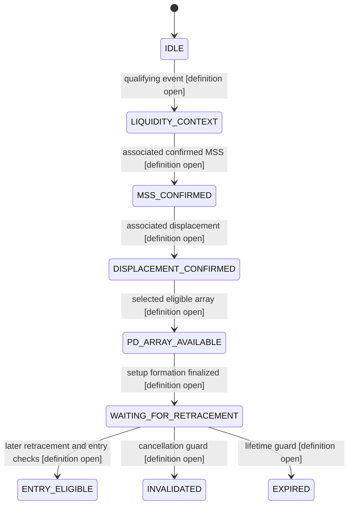

# CP-002 temporal hypothesis design audit

Status: **design audit only; not a frozen hypothesis or implementation**.

Audited checkpoint: `0b0a3a7656f5aad4e10fdc7a8913a50b92d827c3`.

Observer V1 fingerprint: `018885c10da1606cc72a70a9ecb1067ae8d1cb02367e4a7f570a523d3420a6aa`.
Observer implementation identity: `7d079ac8f2a58bf65ef699456e64af9ef8ed700e9ec97f7f1be06aabf6d04363`.
CP-001 development-result fingerprint: `57671bc3eade824bdd97b0cf6d680e43641f093b7555049e578115f6f77e606e`.
CP-001 diagnostic fingerprint: `050e7809a07323c90d3517bd61643f0d880797d2651ae0d5eea0f1054c0c6d5d`.

**Conclusion:** most individual causal detectors and geometric calculations exist. The temporal setup lifecycle, event association, retracement eligibility, cancellation, expiry and entry arbitration are not defined by them. Observer V1 supports a restricted retrospective event chain, not lossless reconstruction of every possible CP-002 definition. Researcher decisions must precede freezing any hypothesis. CP-001's current-MSS/current-price-zone contradiction is not repaired here.

Only source code and frozen metadata were inspected. No market candles, journal datasets, future labels or label distributions were opened. No engines, labelers, benchmarks or market tests were run. This document contains no market-performance claims or parameter recommendations. Existing numeric defaults cited below describe CP-001 or helper APIs; they are not adopted as CP-002 rules.

## 1. Existing deterministic primitive inventory

Status meanings: **fully implemented** means the named primitive has executable deterministic behavior, not that CP-002 integration is complete; **partially implemented** means relevant state exists but required lifecycle semantics are missing; **implemented but unused by candidate generation** refers specifically to frozen CP-001; **unavailable** means no corresponding CP-002 component exists.

| Primitive | Status | Exact implementation and limits |
|---|---|---|
| Completed H4 alignment | Fully implemented | `strategy.timeframes.ContextSeries`, `align_completed_candle`, `TimeframeAlignment`; latest supplied HTF completion at or before execution completion. Equal timestamps are visible. Timeframe labels do not infer duration or validate source aggregation. |
| H4 directional context | Fully implemented | `strategy.engine.HigherTimeframeContext`, `_htf_context`; `strategy.optimized_engine_v2.OptimizedSequentialResearchEngineV2._build_snapshot`; bias follows `strategy.structure.determine_market_bias` / incremental BOS state. Neutral/missing context exists. No multi-timeframe hierarchy or setup-specific H4 persistence rule is implied. |
| Swing confirmation / structural classification | Fully implemented | `strategy.structure.SwingPoint`, `detect_swing_highs`, `detect_swing_lows`, `classify_structure`, `_available_swings`; strict pivots become available at `confirmed_at`, not pivot index. External classification promotes extensions; the `external_window` argument is discarded. |
| Liquidity pools | Fully implemented | `strategy.liquidity_v2.LiquidityPool`, `build_swing_pools`; `strategy.optimized_engine_v2._LiquidityV2` indexes causal pools and current events. Equal-level clustering, source indices, confirmation, internal/external structure and pool identities exist. Regrouping can reset a pool's terminal history under the same pool ID. |
| Liquidity events | Fully implemented | `strategy.liquidity_v2.LiquidityEvent`, `track_liquidity`; `_LiquidityV2.advance`; includes penetration, confirmation, direction, type, level and pool state. Qualifying types, pairing to a future MSS, and age limits remain strategy decisions. |
| Wick sweep | Fully implemented | `track_liquidity` emits `event_type="wick_sweep"`, `state="wick_swept"`, `pool_state="consumed"` for penetration plus rejection close. `strategy.liquidity.detect_sweeps` and `strategy.structure.detect_liquidity_sweeps` are separate sweep helpers with different level/consumption conventions; do not substitute them implicitly. |
| Reclaim | Fully implemented | `track_liquidity` retains a body breach and emits `event_type="reclaim_sweep"`, `state="reclaimed"` when a qualifying close returns within its reclaim window. Penetration time and confirmation time differ; historical availability begins at confirmation. |
| Accepted liquidity break | Fully implemented | `track_liquidity` emits `event_type="structural_break"`, `state="accepted_beyond"`, `pool_state="consumed"` on accepted breach. Its direction differs from the reversal sweep direction for the same liquidity side. This is a liquidity classification, **not** proof of `StructureEvent.kind="BOS"` or MSS. |
| BOS | Fully implemented | `strategy.structure.StructureEvent`, `detect_bos`, `_active_level`; strict close beyond an available active high/low, once per broken swing identity. `strategy.optimized_engine._IncrementalStructure.advance` supplies the incremental equivalent. |
| MSS | Fully implemented | `strategy.structure.StructureShift`, `detect_structure_shift`; opposing valid BOS after a non-neutral prior structural direction. `_IncrementalStructure.advance` emits corresponding current shifts. The type can represent `CHoCH`, but these detectors emit MSS, not an independently defined CHoCH taxonomy. No MSS lifetime exists. |
| Displacement | Fully implemented | `strategy.fvg.Displacement`, `detect_displacement`; `strategy.optimized_engine._IncrementalExecutionState._displacement`. Compares current high-low and body/range to prior positive high-low ranges. Despite a docstring referring to true range, executable reference ranges are high-low, not gap-adjusted ATR. No MSS-to-displacement association/delay rule exists. |
| Dealing range | Fully implemented | `strategy.context.DealingRange`; engine `_build_snapshot` uses current `StructureState.external_low/high` when ordered. `structural_state` can use the latest internal swing until an external one exists. Missing range is representable. No setup-frozen range or range-reset policy exists. |
| Premium / discount / equilibrium | Fully implemented | `DealingRange.equilibrium`, `DealingRange.position`; close compared to midpoint with explicit tolerance. CP-001 checks at the candidate candle, not at a separate temporal entry stage. |
| FVG geometry | Fully implemented | `strategy.fvg.FairValueGap`, `detect_fvgs`; `strategy.imbalance.Gap`, `detect_gaps`; three-candle strict gap confirmed by candle three. Engine snapshots use evolved `Gap` objects. No displacement provenance is attached automatically. |
| FVG mitigation | Fully implemented | `strategy.imbalance.evolve_gap`, `gap_lifecycle`, `Gap.first_touch`, `mitigation_fraction`; `_ExecutionStateV2._advance_gaps_v2` updates current states. State labels may change again on later overlap; eligibility and one-touch retirement are not strategy rules in these helpers. |
| FVG invalidation | Fully implemented | `evolve_gap` and `_advance_gaps_v2`: overlap followed by close through the far boundary marks ordinary gap invalidation. A candle gapping wholly past without overlap is not the same predicate. No setup cancellation is attached automatically. |
| IFVG formation | Fully implemented, with distinct helper contracts | `strategy.fvg.InvertedFairValueGap`, `detect_ifvgs` records first close through a source FVG and reverses direction. Revision 2 creates inversions in `_advance_gaps_v2` during its overlap/invalidation path. Standalone close-through and Revision 2 overlap-gated paths must not be assumed interchangeable for every price-gap case; source selection requires explicit identity and synthetic contract tests. No change is made to either. |
| IFVG subsequent lifecycle | Partially implemented | `InvertedFairValueGap` preserves index, original source index, direction and boundaries. It does not provide a subsequent mitigation, expiry, reinvalidation or re-inversion lifecycle. Observer `pd_state="inverted"` is not proof of continued validity. |
| OTE / retracement geometry | Implemented but unused by candidate generation | `strategy.context.DealingRange.retracement_price`, `ote_band`; pure geometry. Existing OTE helper defaults are 0.62/0.79 and are serialized as unused in CP-001. They do not define a temporal retracement detector or authorize CP-002 use. |
| Protected highs/lows | Fully implemented | `strategy.structure.StructureState`, `structural_state`, `_IncrementalStructure.advance`; protected high is present in bearish execution bias, protected low in bullish bias. Not every direction has a protected anchor on every candle. |
| Candidate-close entry | Implemented but unused as a generation gate | `backtest.structural.protected_swing_levels` uses `candle.close` after a matching `snapshot.signal`; `research.observer.structural_levels` extends the same geometry to a selected rejected observation. Neither defines CP-002 intrabar/next-open entry. |
| Structural stop / validity | Implemented but unused as a generation gate | `protected_swing_levels`, `StructuralLevelError`, `research.observer.structural_levels`; opposite protected execution swing, explicit missing/nonfinite/zero-risk/directionally-invalid rejection. No fallback. Setup-time versus entry-time anchoring remains open. |
| Normalized R objective | Implemented but unused by candidate generation | `backtest.simulator.HypotheticalLevels.validate`, `reward_risk`; `protected_swing_levels(reward_risk=2.0)` builds entry ± reward multiple × risk. `research.labels.label_observation` separately supports 1R/2R touch races. No CP-002 objective is frozen. |
| Research horizon / conservative ambiguity | Implemented but unused by candidate generation | `backtest.structural.simulate_protected_swing_candidates(max_bars=96, same_candle_policy="conservative")`, `backtest.simulator.simulate_candidates`; `research.labels.label_observation(horizon=96)` distinguishes censoring and full-window excursions. These are post-entry APIs, not setup-lifetime policies. No calls were made in this audit. |
| Observer temporal references | Partially implemented for arbitrary CP-002 reconstruction | `research.observer.ResearchObserver`, `ObservationRecord`, `EventRef`, `SwingRef`, `PDRef`, `LiquidityRef`, `capture_selection`; causal current events and bounded latest directional references. Detailed coverage/gaps below. |
| Legacy sequence helper | Implemented but unused by frozen candidate generation | `strategy.entries.StrategySetup`, `find_setups`: sweep → later FVG → later IFVG → later displacement, with its own first-match/break choices. It lacks the requested H4/liquidity/MSS/retracement lifecycle and reverses direction through inversion. It is not CP-002 and must not silently supply its rules. |
| Generic session / event context | Implemented but unused by frozen candidate generation | `strategy.temporal_context.SessionWindow`, `HistoricalEventVersion`, `HistoricalEventStore`, `contextualize_signal`; point-in-time context tools, not an authorization to include sessions/news in CP-002. No event data inspected. |
| Temporal setup lifecycle / entry arbitration | Unavailable | No CP-002 active-setup manager, immutable setup identity, expiry/cancellation engine, retracement-entry evaluator or duplicate-entry registry exists. `research.observer.cohort` is descriptive filtering, not such an evaluator. |

Existing CP-001 values—swing window 2, zero liquidity/equilibrium tolerances, reclaim window 1, displacement lookback 5/range multiple 1.5/body fraction 0.6, 2R objective and 96-bar post-entry horizon—are implementation facts only. Retention or any change for a separate hypothesis must be explicit and justified without inspecting outcomes.

## 2. Abstract temporal state machine

The map identifies required technical states, **not approved transition guards**. H4 is an orthogonal context whose sampling and persistence rules are unresolved. Invalidated/expired are terminal reasons for a particular setup; another setup's lifecycle is a separate object.

Cancellation/expiry edges may be needed from **every active state including ENTRY_ELIGIBLE**, not only the displayed waiting state. Whether and how to create an entry record, mark a setup consumed, allow a retry, or start another setup is unresolved. ENTRY_ELIGIBLE is not a broker operation and does not imply an entry has occurred. Pre-entry INVALIDATED is distinct from a post-entry structural stop touch.

| Transition | Existing causal input | New strategy definition required |
|---|---|---|
| IDLE → LIQUIDITY_CONTEXT | H4 snapshot; confirmed terminal liquidity event | H4 gate/time; allowed type, direction, structure, age, pool version and context selection. |
| LIQUIDITY_CONTEXT → MSS_CONFIRMED | `StructureShift.index/direction/broken_swing_index`; event confirmation indices | Association to which liquidity event; strict versus equal-candle ordering; directional alignment; replacement of earlier setup. |
| MSS_CONFIRMED → DISPLACEMENT_CONFIRMED | Current `Displacement` and retained index | Same-candle versus later evidence; direction; delay; select first or another qualifying event; what absent/opposite displacement does. |
| DISPLACEMENT_CONFIRMED → PD_ARRAY_AVAILABLE | Causal FVG creation or IFVG inversion and source identity | Eligible types, source/formation ordering, relation to displacement, priority, state and selection. An already-created array can only be accepted if explicitly permitted. |
| PD_ARRAY_AVAILABLE → WAITING_FOR_RETRACEMENT | Array boundaries plus range/context at completion | Which range/anchor/context is frozen or updated; exact setup-ready index; formation candle eligibility. No dedicated waiting transition primitive exists. |
| WAITING_FOR_RETRACEMENT → ENTRY_ELIGIBLE | Subsequent OHLC, zone, H4, selected array/structural references | Retest/touch/body/close/OTE geometry, departure requirement, entry-stage price zone, cancellation precedence, entry convention and duplicate policy. |
| Active state → INVALIDATED | Opposite MSS, H4 change, price/anchor crossing, PD invalidation, liquidity changes where observable | Which events cancel; comparisons; setup identity affected; whether the cancellation is irreversible; same-candle precedence. |
| Active state → EXPIRED | Causal bar index / completion time | Start point, unit, maximum lifetime, inclusion of deadline, gaps and stage-specific expiry. No value is selected. |

A candle may report MSS, displacement and an array simultaneously. Their equal indices prove co-availability at completion, **not** intrabar order. The researcher must decide whether co-availability satisfies particular links and whether multiple logical transitions occur at that completion. It cannot justify retroactively executing an earlier wick touch using an MSS/FVG only confirmed at the candle close. The user's concept specifies a later retracement; the formation milestone and earliest permitted retracement evaluation still need a precise definition.

## 3. Unresolved decision register

Every row is **OPEN**. Explicitly retaining an existing convention is an answer; silence is not. An explicit “not required”, “not applicable” or “no limit” may be a researcher answer, but none is chosen here. The register covers the decisions found in the requested chain and inspected code; future scope expansion requires additional entries.

Firewall tags: **A→B** means the conceptual requirement is supplied by the user but its executable meaning is not; **B** means a determinism/provenance convention is needed. Any value or variant chosen because it improves observed development behavior becomes **C** (data-dependent tuning); no C value is recommended.

| ID | Researcher decision to freeze | Basis / ambiguity |
|---|---|---|
| D01 | Instruments, execution/context timeframes, source/provider and allowed research partitions | B; existing H4/M15 CP-001 infrastructure does not silently freeze a new experiment's scope. No partition access is authorized here. |
| D02 | Which exact detector implementation/revision supplies each event; whether existing primitive configuration is retained verbatim | B; legacy sweep/sequence helpers, standalone IFVG and Revision 2 paths are not interchangeable contracts. |
| D03 | Initial warm-up, start/reset boundary, carried pre-prefix state and missing-context behavior | B; observer starts at index zero; restarting changes available historical state. |
| D04 | Numeric comparison conventions, units, tick/price precision, equality and tolerances | B; strict breaks, inclusive touches and midpoint tolerance differ by primitive. No tolerance change is selected. |
| D05 | Whether sessions/news/additional timeframes or filters are included or explicitly excluded | B; helpers exist but concept does not specify these additions. |
| D06 | H4 direction requirement at liquidity, MSS, formation, retracement and/or entry | A→B; sample times must be explicit, including neutral/unavailable context. |
| D07 | Whether MSS direction must match H4, and which completed H4 reference is used | A→B; context before the candle versus equal-time completed context is not an intrabar fact. |
| D08 | Whether H4 alignment must remain continuous, be rechecked only at entry, or be latched | A→B; neutral, opposite, changed-and-restored and unobserved-gap cases need policy. |
| D09 | Which liquidity event types qualify: wick sweep, reclaim, accepted break, pending breach/touch or other specified set | A→B; accepted break is continuation-direction evidence, not the same reversal semantics as a sweep. |
| D10 | Whether liquidity must be external; how internal/mixed clustered pools and later reclassification are handled | A→B; external is the detector's extension-based label, not automatically a session or higher-timeframe level. |
| D11 | Direction/side relationship between qualifying liquidity and the intended setup/MSS | A→B; pool side alone is insufficient because sweep and accepted-break directions differ. |
| D12 | Whether liquidity must precede MSS strictly, or same-candle confirmation may qualify | A→B; explicitly establishes the reciprocal requirement that MSS follow the chosen liquidity event. |
| D13 | Whether liquidity age/order starts at penetration, confirmation, or another defined availability timestamp | B; a reclaim cannot be known at its earlier penetration candle. Availability cannot be backdated. |
| D14 | Maximum liquidity age and at which stages it is tested | B; age unit, inclusive bound and no-limit possibility require an explicit answer. |
| D15 | Which event/pool is paired when several qualify, and deterministic tie-breaks | B; current CP-001 latest matching terminal selection is not a temporal association rule. |
| D16 | Reuse of consumed events; pool regrouping/reconfirmation; counter-sweep or renewed consumption effects | B; distinguish terminal qualification from setup consumption and pool generation. |
| D17 | MSS definition/structure class and whether BOS or CHoCH is an alternative | A→B; MSS exists, but substituting another label is a strategy decision. |
| D18 | First versus latest/repeated MSS association; whether a new same-direction MSS replaces or starts a setup | B; opposite-MSS cancellation separately requires D40. |
| D19 | Whether displacement must occur on the MSS candle or may occur afterward | A→B; the diagram alone does not choose equality versus strict order. |
| D20 | Maximum MSS→displacement delay; clock, boundary and expiry action | B; no delay value is implied by existing displacement lookback. |
| D21 | Required displacement direction, source timeframe and detector thresholds | A→B; explicitly retain or define the primitive contract, without trying candidate settings on data. |
| D22 | First versus later/repeated displacement; opposite displacement and missing-event behavior | B; an association policy is not supplied by the current boolean gate. |
| D23 | Eligible PD types and any IFVG priority | A→B; CP-001's unconditional historical IFVG preference is not a CP-002 decision. |
| D24 | Exact selected FVG/IFVG among multiple candidates and tie-breaks | B; newest source FVG and newest inversion time are different orderings. |
| D25 | Must source FVG form after MSS and/or displacement; does equal-candle formation qualify? | A→B; specify each relationship, not merely “fresh array”. |
| D26 | For IFVG, must original source formation, inversion, or both follow MSS/displacement? | B; `source_index` and inversion `index` differ; original FVG direction is opposite IFVG direction. |
| D27 | Must the array be produced by the associated displacement/impulse, and what constitutes that relationship? | A→B; neither gap type contains a displacement-parent identity. |
| D28 | Eligibility of new/active/partial/mitigated/invalidated FVG; first-touch or mitigation-fraction criteria | B; stored lifecycle states alone do not define acceptable entry evidence. |
| D29 | IFVG post-formation validity, mitigation, reinvalidation and possible re-inversion handling | B; missing detector lifecycle, not a value that may be inferred from an `inverted` label. |
| D30 | Maximum PD age and age origin: source creation versus inversion | B; no age value chosen. |
| D31 | Whether selected array is frozen, replaced, or accumulated while waiting | B; a newer preferred array must not silently change an existing setup. |
| D32 | Dealing-range anchors and reference time; frozen setup range versus current range; missing/reset range handling | A→B; range prices exist but their setup meaning is not defined. |
| D33 | Exact retracement target: selected array, midpoint, price zone, OTE, conjunction or another specified geometry | A→B; “retracement” is not executable by itself. |
| D34 | Wick touch versus close/body penetration; required depth, boundary equality and direction | A→B; OHLC supplies different predicates, not an intrabar path. |
| D35 | Must price first depart the selected zone; what makes it a re-entry rather than remaining inside? | A→B; initial-inside, through-gap and repeated-touch cases need answers. |
| D36 | Whether OTE is required; anchors, fractions and overlap with PD/zone if used | A→B; the user's current sequence does not specify OTE as mandatory. Existing fractions are not a recommendation. |
| D37 | Premium/discount/equilibrium relationship at ENTRY, its reference range and equality rule | A→B; do not reuse the current-MSS/current-zone conjunction as a temporal guard. |
| D38 | Setup-ready milestone, earliest later retracement candle and same-completion transition policy | B; no retroactive use of formation-candle wick information. |
| D39 | Maximum setup lifetime, origin, clock, inclusive deadline, stage deadlines and resets | B; pre-entry lifetime is separate from the existing 96-bar post-entry horizon. |
| D40 | Whether opposite MSS cancels; internal/external scope and event ordering | A→B; conditional test plans do not choose “yes”. |
| D41 | Whether H4 change/neutrality cancels, suspends or merely fails entry; restoration behavior | A→B; continuous alignment may need more context history than Observer V1 exposes. |
| D42 | Structural price/anchor cancellation conditions before entry | A→B; frozen/current reference, close versus wick, equality and protected-level replacement must be explicit. |
| D43 | PD invalidation/mitigation/replacement and liquidity consumption/counter-sweep cancellation effects | B; loss of a latest reference is not an explicit cancellation event. |
| D44 | Cancellation versus expiry versus entry on the same candle; irreversible cancellation versus suspension | B; must not resolve conflicts by incidental loop ordering. |
| D45 | Gap/weekend/session-boundary resets, missing candles, wall-clock versus bar-count deadlines | B; missing observations cannot be treated as proof that no cancellation occurred. |
| D46 | Maximum concurrent setups, per-direction/per-instrument scope and cross-instrument independence | B; bounded implementation cannot silently discard valid setups. |
| D47 | Arbitration when multiple eligible setups share liquidity, MSS, PD array or entry candle | B; global CP-001 trigger priority is not a setup-level tie-break rule. |
| D48 | Duplicate-entry key, suppression lifetime, event reuse, re-entry/retry and setup-consumed transition | B; one event may otherwise create entries on multiple retracement candles. |
| D49 | Behavior after setup completion, cancellation, expiry, restart and partial journal availability | B; resetting to IDLE must not accidentally reuse consumed identities. |
| D50 | Entry price/time convention: completion close, later open, level touch or other explicit convention | A→B; touch-trigger eligibility and fill price are separate decisions. No broker execution is in scope. |
| D51 | Gap-through entry, unavailable entry price and same-candle risk-before-entry treatment | B; a close-confirmed setup cannot be assumed filled earlier inside that bar. |
| D52 | Structural stop anchor identity/time: setup formation, MSS, liquidity, or entry-time protected execution swing | A→B; existing protected-swing API is a convention to consider explicitly, not an automatic CP-002 choice. |
| D53 | Stop buffer/equality, frozen versus moving stop, missing/nonfinite/zero/directionally-invalid anchor policy | B; no fallback stop is authorized by this audit. |
| D54 | Objective convention: normalized R multiple versus specified structural target; reference time and freezing | A→B; existing 1R/2R research interfaces do not select CP-002's objective. |
| D55 | Maximum post-entry horizon, first counted candle, censoring and incomplete tail handling | B; explicitly retain or define, without borrowing setup lifetime. Existing 96 is a CP-001 convention only. |
| D56 | Post-entry same-candle ambiguity, gaps, management and excursion semantics | B; conservative races, full-window MFE/MAE and realized/stopped paths are distinct abstractions. |
| D57 | Whether costs, partials, trailing/break-even or other management are excluded or separately specified | B; available helper features must not expand the hypothesis implicitly. |
| D58 | Observation population, source/version identities, required extra fields and replay coverage | B; eligible-only CP-001 rows cannot define the universe of temporal entries. |
| D59 | Causal setup-event ledger, reason codes, reproducible reset/checkpoint rules and label separation | B; transition provenance must survive selection replacement and restarts. |
| D60 | Research preregistration: rationale/provenance for every decision, future descriptive endpoints, authorized data-use protocol and change control | B; implementation/backtesting require a later authorization; no outcome-based selection is permitted by this audit. |

Before CP-002 can be frozen, the researcher must answer D01–D60 in a decision sheet, recording an answer, rationale, provenance category, exact predicate/comparator or explicit exclusion, and any dependencies. Grouped answers may cover several IDs, but every ID must be resolved. In particular, numeric age/delay/lifetime/OTE/objective/horizon choices remain blank. Implementation-only ordering conventions that affect eligible observations still need explicit researcher acceptance.

## 4. Observer V1 coverage and missing capabilities

`ResearchObserver.observe` consumes every completed candle internally. Its **default export population is CP-001-trigger-eligible only**. `include_untriggered=True` is required to preserve later candles that merely retrace without a new CP-001 trigger. No new all-candle export was generated in this audit, and no existing dataset was opened or assumed to have that coverage.

| Link / query | What V1 can reconstruct from suitable records | Missing or conditional coverage |
|---|---|---|
| H4 context → liquidity | H4 bias/index/time plus latest bullish/bearish terminal `LiquidityRef`; selected-direction detailed event fields | Not all current events/pools; per-direction `LiquidityRef` omits internal/external structure, penetration/confirmation details and source membership. Those details exist only for the CP-001-selected direction in that row. |
| Liquidity → MSS | Join retained event indices to `current_mss`/latest directional MSS and compare causal completion indices | Several qualifying liquidity events on the same candle can collapse to one latest reference per direction. No explicit parent association, pool-generation/reset event or complete pending-breach history. |
| MSS → displacement | Current MSS and displacement, directional latest indices and matching ages; compare exact bar indices | No stored parent MSS ID on displacement. A later researcher must apply a preregistered association; current-trigger selected direction may differ from a retained setup's direction. |
| Displacement → PD | Selected `pd_index`, `pd_source_index`, directional `PDRef`, bounds and state can establish dates for those references | IFVG preference can hide ordinary FVGs indefinitely. Not all source gaps/inversions appear; no displacement-parent link, complete creation event stream or complete lifecycle deltas. |
| PD → retracement | With all-candle OHLC, a retained fixed array/range can be compared to later closes or high/low under an approved predicate | Cannot recover an array never recorded. Lifecycle updates after an older array loses selection may be absent. No first-touch/mitigation-fraction/invalidation-index history in V1 PD references. |
| Liquidity age at retracement | Both latest directional `LiquidityRef.index` values allow age calculation even on no-trigger rows | A specific older setup-bound pool needs its own retained reference and generation history. A replacement latest reference does not establish that old context is valid or cancelled. |
| H4 remained aligned | At each observed execution completion, compare H4 bias to a retained setup direction | No full intervening H4 timeline when execution timestamps gap or aligned H4 index jumps. Continuous intra-gap alignment is not established by endpoint samples. |
| Structural cancellation / entry levels | Protected `SwingRef` identity, confirmation and price; range prices and current structural events | Full external-range anchor identities are absent; `EventRef` omits structural class, broken-side/confirmation and previous MSS state. Existing `entry/invalidation/risk_distance` fields follow the CP-001-selected direction, not an arbitrary earlier setup direction. |
| Accepted temporal entry | Nothing in V1 declares it | `accepted_by_cp001_v1`, gate counts and `cohort` remain CP-001 descriptions. They are not CP-002 eligibility or transition results. |

**Sufficiency conclusion:** V1 permits reconstruction of **some** liquidity → MSS → displacement → visible-selected-PD → later-retracement chains, conditional on all-candle coverage and available identities. It is **not sufficient for every open definition** in D01–D60. Records once observed may be retained by an offline reader after a pointer changes, but this cannot recover events that were never recorded or subsequent unrecorded lifecycle changes. A missing export row is not evidence of no event or no cancellation.

Potential additional observational capabilities, conditional on final research definitions—not implemented here:

1. An append-only causal event stream of **all relevant** liquidity candidates/transitions, with event availability, pool generation/version, structure, source membership identity, regroup/reset and pending/terminal status. No particular subset is selected here.
2. Complete source-gap creation/inversion references, with availability and source indices kept distinct; lifecycle deltas including first touch, mitigation fraction and invalidation index; retained updates for setup-bound arrays after they cease to be latest. A subsequent IFVG lifecycle would first require a definition, not just a new field.
3. Full structural provenance where needed: broken side, internal/external class, confirmation index, previous MSS state, and external-range high/low swing identities. Prices alone cannot distinguish all equal-priced anchor replacements.
4. Completed H4 event/context changes between execution observations if continuous alignment is required. No interpolation of missing H4 states is justified by current V1 rows.
5. A separate temporal evaluator ledger containing setup ID, linked event versions, transition index/available-at time, former/new state, frozen reference values, deadlines, cancellation/expiry reasons, arbitration outcome and entry-consumed identity. These are new hypothesis/evaluator records, not CP-001 gate fields.
6. Explicit coverage/start-state metadata for any future reconstruction, including all-candle versus eligible-only population, source namespace, partition/reset boundaries and reproducible initial state.

Many missing fields are already present in `EngineSnapshot` or Revision 2 state and could be observed read-only in a separately versioned future adapter. Other items (IFVG future validity, cancellation guards, parent-event association) are absent **semantics** and cannot be solved by copying more columns. V1 rejects non-default `EngineConfig` and requires the exact Revision 2 engine type; it is not an unversioned adapter for a new strategy configuration. No observer changes are made here.

## 5. Development-data firewall

| Category | What is justified now | What is not justified |
|---|---|---|
| A: pre-existing concept | The user's stated chain: HTF context → liquidity → MSS → displacement → PD array → later retracement → entry evaluation → structural invalidation → hypothetical objective. | No claim that “SMC/ICT” uniquely implies a liquidity subtype, mandatory OTE, fixed age, exact entry price, stop anchor or objective. No earlier detailed rulebook was supplied in this request. |
| B: deterministic conventions | Causal availability, identities, source namespaces, ties, equal-candle treatment, state ownership, resets, reference freezing, explicit missing-data behavior and separately typed outcomes must be specified. | A convention that changes the set of entries cannot be treated as harmless implementation trivia or silently selected by an engineer. |
| C: choices informed by observed development behavior | Identify and document such provenance if it occurs in later research; do not disguise it as A or B. | Trying event types, delays, ages, OTE bands, cancellation rules, horizons or priorities to increase candidates, improve outcomes or favor observed cohorts. No C values are selected or recommended. |

The already-known CP-001 contradiction is the stated motivation for asking about temporal design. It does not identify the correct delay, range, retracement or cancellation rule. A previously seen near miss is not evidence supporting one of those choices. This audit deliberately does not inspect existing journal rows or label distributions, including development outcomes.

Each future decision should cite its pre-existing researcher rationale, or explicitly identify a newly chosen deterministic convention. A newly frozen hypothesis does not make already-seen development data unseen again. Later exploratory changes require a new documented hypothesis/version and renewed authorization; this document does not authorize running either development research or locked partitions. Synthetic acceptance tests can check faithful implementation and reachability, but their expected outcomes must come from the frozen definition, not from market-derived desired results.

## 6. Incremental computational design (not implemented)

A future temporal component could consume causal event deltas alongside the unchanged engine. It should own setup state separately from engine state, Observer V1 and the offline outcome labeler. Do not repeatedly call prefix-wide `find_setups`, `detect_bos`, `detect_ifvgs`, `gap_lifecycle`, or scan/re-sort all cumulative snapshot histories on every candle.

- **Identity:** namespace an event by source dataset/instrument/timeframe, detector revision, source identity and causal availability index. For liquidity, include enough generation/version information to distinguish regrouping under an existing pool ID. Inversion identity needs original source index as well as inversion index; candle index alone need not identify every inversion.
- **Bounded active setup state:** retain IDs, direction, current stage, linked event versions, chosen/frozen levels, timestamps, deadline tokens and consumed flags. Bound concurrency only through the explicit researcher policy D46. If the approved policy is unbounded, report that limitation rather than silently evicting setups.
- **Event-driven updates:** index setups by instrument/direction and referenced liquidity/structural/PD identity so an event updates affected setups rather than all history. Process same-completion events under the approved D38/D44 ordering, not incidental dictionary iteration.
- **Expiry queue:** use a deadline heap or time-indexed queue for the chosen clock, with generation tokens for cancellation/replacement. Pop due deadlines once and invalidate stale tokens; periodically compact stale entries so the heap does not grow forever. The data structure does not choose the deadline, inclusive bound or whether expiry precedes entry.
- **PD monitoring:** keep bounded references to selected arrays and their current causal lifecycle, subscribe to deltas for arrays used by active setups, and release them after terminal setup states. If required deltas are not exposed, design a separately audited read-only adapter; do not hide an O(n) full-history diff per candle.
- **Retracement monitoring:** for a fixed bounded number of active setups, a per-candle scan is bounded. For larger approved populations, price/interval indexes can return only setups whose zones intersect the current OHLC range. Overlap can make many setups relevant on one candle; acknowledge that cost rather than claim constant time.
- **Cancellations and duplicates:** route changes through identity indexes. Persist terminal/consumed keys according to the researcher-defined reuse lifetime; do not prune a duplicate registry merely for memory if that could permit a prohibited re-entry.
- **Provenance and persistence:** append compact transitions to a journal; checkpoint active state, event cursors, deadline/duplicate state and identity hashes. A restart must replay the same lifecycle. Any future checkpoint implementation is outside this audit.
- **Outcomes:** emit a frozen entry-evaluation record after approved guards. Only a separate offline stage may inspect subsequent candles. No label value is an input to setup state, cancellation or entry selection.

Let n be processed execution candles, E new event deltas, K the explicitly permitted active setup bound, and U actual relevant setup updates. The additional state machine can target O(nK + E + U log K), or indexed equivalents, instead of repeated O(n²) history reconstruction. This is an algorithmic design bound, not a measured runtime or market-performance claim. Truly unbounded overlapping setups or quadratic numbers of requested output associations can themselves require quadratic work; a data structure cannot remove that output cost without changing semantics. Revision 2 still retains its own snapshots and performs existing cumulative work; a separate bounded evaluator does not make the entire existing pipeline linear or authorize modifying the engine.

## 7. Required synthetic test plan before historical development access

No tests below are implemented or executed by this audit. Expected results must be derived from the completed decision register, including negative cases for policies the researcher excludes. Symbols such as L, D and H denote future declared bounds, not recommended numeric values.

| Test family | Required fixtures and assertions |
|---|---|
| Exact transition trace | Controlled causal fixtures produce the declared state at every completion; assert setup/event IDs, directions, transition reasons and terminal states, not only a final entry count. Include a fully satisfiable temporal path under the approved definition. |
| Liquidity identity/types | Wick, reclaim, accepted break and nonterminal touch/breach; reversal versus continuation directions; internal/external/mixed pools; multiple same-candle pools and regrouping under the same ID. Enforce D09–D16 exactly. |
| Correct/wrong ordering | Liquidity confirmation before/after/equal to MSS; penetration before MSS but confirmation after; no backdating to penetration or swing pivot. Disallowed ordering must reject with the declared reason. |
| MSS/structure | BOS without prior opposing state, genuine opposing MSS, repeated same-direction MSS, simultaneous structural events, exact close equality, structural classes and future-unconfirmed swings. |
| Delayed displacement | Same-candle, first later, repeated and wrong-direction displacement; D−1/D/D+1 around a declared maximum delay; retain or reject according to D19–D22 rather than presuming delayed evidence is valid. |
| PD timing/association | FVG before/after/equal to MSS and displacement; IFVG source before but inversion after; arrays unrelated to the selected displacement; several candidate arrays and deterministic priority. |
| PD lifecycle | New/partial/mitigated/invalidated gap, first touch, repeated touch, disappearance from latest selection and source replacement. Separate overlap-plus-close invalidation from whole-candle gap-through for the declared detector. IFVG lifecycle cases only after its semantics are defined. |
| Later retracement | Already inside at formation, actual departure/re-entry, wick-only touch, body/close penetration, boundary equality, optional OTE overlap and entry-stage premium/discount against declared anchors. No implicit passing predicate. |
| No same-candle hindsight | FVG/MSS established only at close plus an earlier potential wick touch; ensure no retroactive entry. Test equal-time H4 completion and approved multi-transition behavior without claiming intrabar sequence. |
| Range/anchor identity | Range moves while waiting, equal-price anchor identity changes, missing/inverted range, protected anchor disappears, directionally invalid/zero/nonfinite risk; enforce frozen versus current reference policy. |
| Expiry | L−1/L/L+1, each permitted origin and clock, stage deadline, replacement/reset, stale queue token and simultaneous deadline/entry. Check the declared precedence. |
| Opposite MSS cancellation | Opposite shift at each active stage, same-candle entry/shift and new shift after cancellation. Assert cancel/suspend/ignore as approved; the test family does not choose a behavior. |
| H4 change behavior | Aligned/neutral/opposite/restored context, changes at each stage and entry, index jumps over missing execution periods. Never infer continuous alignment from matching endpoints. |
| Other cancellation | Structural anchor touch/close breach, array invalidation, counter-sweep, pool reset/consumption and simultaneous cancellation sources. Verify exact reason priority and affected setup IDs. |
| Duplicates/retries | Repeated retracement bars, same entry candle, shared evidence, expired/cancelled setup reuse and replay restart. Exactly the researcher-defined suppression key and lifetime apply. |
| Overlapping setups | Same/opposite directions, same/different instruments, shared PD/liquidity identities and configured capacity. Arbitrations must be deterministic; no silent capacity eviction. |
| Timestamp gaps | Missing candles, weekend/session boundaries, UTC equality, execution/H4 alignment and bar ages versus elapsed time. Partial prefix/coverage must be rejected or handled as specified. |
| Prefix/future-row invariance | Append arbitrary future OHLC and contexts; all prior state transitions, reasons, selected references and frozen entries remain identical. No future label fields in state-machine inputs. |
| Structural invalidation / objective interface | Exact entry-time stop reference and R geometry; missing anchors retain explicit reasons, never an invented fallback. Test post-entry boundary conventions separately using synthetic data only, once authorized. |
| Observer reconstruction | Equivalent event input and suitable all-candle records reproduce the same trace only for definitions V1 can represent. Missing never-selected events/lifecycle updates must fail coverage checks, not silently approximate. |
| Restart / event ordering | Replay, checkpoint restore, stable tie ordering, duplicate events and source-version mismatch; deterministic logs and immutable engine/observer/config state. |
| Incremental resource behavior | Synthetic growth and instrumentation confirm no cumulative-history scan/copy per candle, deadline compaction and bounded approved setup state. No market performance test. |

Before any development run, require approved D01–D60, a separate frozen hypothesis artifact, an explicit implementation authorization, observer coverage decisions, synthetic transition/causality tests, equivalence guarantees for untouched components, and boundary-safe audits. None of those future authorizations or artifacts is supplied by this document.

## 8. Design-only checks and stop boundary

Checks for this documentation change: starting HEAD/status; canonical checkpoint fingerprints and observer implementation-file hashes; source-symbol references; local Markdown path references; decision-ID completeness; documentation whitespace; documentation-only change scope; repository hygiene; Git integrity and final synchronization. No strategy tests, outcome simulations, benchmarks or market-data checks are necessary for a documentation-only audit and none are run here.

No CP-002 strategy was implemented or frozen. No CP-002 outcomes were calculated. No parameters were optimized. CP-001 and Observer V1 remain unchanged. No validation/holdout data was accessed, including 2023–2024 or 2025–2026. No CP-002 experiment artifact is created. Stop after this design audit.
